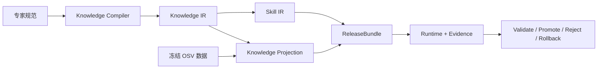

# Expert Skill Distillation System

一个把专家材料编译成 **可追溯知识、可执行 Skill 与可查询知识投影** 的研究级系统。

它不是把文档直接改写成一段 prompt。系统会保存来源与精确证据位置，构建 Knowledge IR，再分别生成稳定的 Skill IR 和动态 Knowledge Projection，最后把二者连同验证器、权限和依赖闭包发布为不可变 ReleaseBundle。每次运行、晋升、拒绝和回滚都由真实 artifact 与 SQLite 状态驱动。

## 它解决什么问题

专家知识并不都适合固化成 Skill：

- 稳定流程、约束、例外和拒绝条件适合进入 Skill；
- 公告、版本范围、环境事实和长尾案例应在运行时查询；
- 执行证据用于判断候选更新是否值得晋升，而不是让单条 bad case 直接改写 Skill。

本项目把这三个生命周期连接起来：



## 当前可运行的 V1

V1 聚焦一个边界清楚、可确定验证的任务：

> 根据 pinned `requirements.txt`、environment profile 与冻结 OSV snapshot，判断一个 Python dependency–advisory pair 是否适用。

系统当前支持：

- Markdown 专家规范、pinned requirements、冻结 OSV JSON 三类 source adapter；
- section-aware EvidenceUnit，保留行号、字节范围和来源 digest；
- Capture 到 Source-Grounded Validation 的 Stage 0–9 编译链；
- `Skill / Knowledge / Both / None` 透明投影；
- 内容寻址 artifact store 与 SQLite 元数据真相源；
- 不可变 ReleaseBundle、ActiveBinding 与 session pin；
- `advisory_applicable / advisory_not_applicable / unresolved` 领域结果；
- `completed / blocked / runtime_failure` 运行状态；
- 候选验证、CAS 晋升、危险更新拒绝与完整 Bundle 回滚；
- `no_skill / full_material / direct_to_skill_ir / compiler_distilled_skill` 诊断入口。

## 5 分钟运行

需要 Python 3.11 或更高版本。

```powershell
python -m venv .venv
.\.venv\Scripts\Activate.ps1
python -m pip install -e .[dev]

eskill --state-dir .eskill demo --data-dir data/v1_walking_skeleton
```

成功后会返回真实的：

- `bundle_digest`
- `session_id`
- dependency/advisory decision
- `VERSION_IN_RANGE` 等 reason code
- OSV snapshot、query contract 与 result digest

示例数据中的 OSV 记录来自官方 API：`PYSEC-2018-28`。原始文件及来源 hash 固定在 `data/v1_walking_skeleton/SOURCE_MANIFEST.json`。

## 逐步使用

```powershell
eskill --state-dir .eskill init

eskill --state-dir .eskill source add `
  data/v1_walking_skeleton/expert_spec/python_advisory_review.md `
  --adapter expert-document --source-id expert-spec

eskill --state-dir .eskill source add `
  data/v1_walking_skeleton/osv/PYSEC-2018-28.json `
  --adapter osv-snapshot --source-id osv-snapshot

eskill --state-dir .eskill build python-advisory
eskill --state-dir .eskill validate bundle <bundle-digest>
eskill --state-dir .eskill promote python-advisory <bundle-digest> --expected-generation 0

eskill --state-dir .eskill run python-advisory `
  --requirements data/v1_walking_skeleton/runtime_inputs/requirements.txt `
  --environment data/v1_walking_skeleton/runtime_inputs/environment.json `
  --advisory PYSEC-2018-28
```

证据检查与版本控制：

```powershell
eskill --state-dir .eskill inspect session <session-id>
eskill --state-dir .eskill inspect bundle <bundle-digest>
eskill --state-dir .eskill history
eskill --state-dir .eskill rollback python-advisory <old-bundle-digest> --expected-generation <n>
eskill --state-dir .eskill baselines
```

## 为什么 Skill 与知识投影分开

Skill 只声明“需要冻结 advisory 和 affected range 证据”，不写入具体 CVE/OSV 事实。KnowledgeAccessBinding 决定当前 Bundle 使用哪个固定 snapshot 与 provider。

因此只更新 OSV snapshot 时：

```text
Skill IR digest              不变
Knowledge Projection digest  改变
ReleaseBundle digest         改变
```

这让稳定方法与动态事实可以独立更新、验证和回滚。

## 仓库结构

```text
src/expert_skill_system/       V1 Compiler、Registry、Runtime、Deployment 与 eskill CLI
data/v1_walking_skeleton/      冻结专家规范、官方 OSV snapshot 与任务输入
tests/v1/                      V1 contract / integration / transaction tests
docs/design_v03/               Freeze v1.0.3 架构与方法规格
src/skill_deployment/          旧受控实验系统，保留作 legacy baseline
outputs/ 与 reports/           历史实验产物和阶段报告，不是 V1 runtime state
```

V1 runtime state 只写入用户指定的 `.eskill/`：

```text
.eskill/artifacts/sha256/      内容寻址不可变工件
.eskill/metadata.sqlite        source、build、binding、session、event 真相源
.eskill/indexes/               adapter-owned 查询投影
.eskill/schemas/               导出的冻结 JSON Schema
```

## 验证

```powershell
python -m pytest -q
python -m ruff check src/expert_skill_system tests/v1
```

本仓库已经在独立 venv 中完成 editable install、`eskill.exe` 一键 demo 和 V1 测试。详见 [V1 Quickstart](docs/V1_WALKING_SKELETON_QUICKSTART.md)。

## 当前证据边界

已经证明的是一个可安装、状态驱动、可审计的 Core Walking Skeleton。它证明 Knowledge IR、Skill IR、Knowledge Projection、ReleaseBundle、Runtime 与部署事务能够连成真实闭环。

当前不能据此声称：

- 通用 open-world 自动蒸馏已经成立；
- Knowledge Compiler 已稳定优于直接生成；
- evolution 已稳定产生更优 Skill；
- AgentHost 或 Harbor 外部评测已经通过；
- 系统是生产级漏洞扫描器；
- advisory applicability 等价于漏洞可达、可利用或项目已受影响。

当前自动编译使用保守、可审计的 V1 显式规则路径；独立 LLM-as-Judge、AgentHost qualification 和公开外部任务仍是后续研究证据门，不会用确定性 ReferenceDecisionBackend 结果冒充。

## 安全边界

项目只处理防御性的依赖公告适用性、代码审查和修复验证。它不生成 exploit，不执行攻击链，也不访问未授权目标。

## 许可证

项目代码采用 [MIT License](LICENSE)。第三方冻结数据保留各自来源与许可说明。
