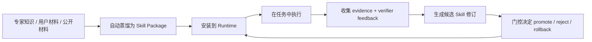

# Expert Skill Distillation Prototype

一个面向 Agent 的研究级原型：把专家知识或公开材料蒸馏成可安装的 Skill，再用执行证据和 verifier 反馈推动 Skill 进化。

它想解决的不是“某个 prompt 多过几个 case”，而是更底层的问题：

> 能不能把知识蒸馏、安装运行、证据收集、候选修正、晋升/拒绝/回滚，做成一条真实可执行的闭环？

## 我们真正要做什么

这个仓库的主线一直只有两段，而且现在已经都落到了代码和 fresh evidence 上：



换句话说，这不是一个单纯的安全审计 prompt 仓库，而是一个：

**Evidence-Grounded Skill Evolution Runtime**

## 现在已经做到什么

下面这些能力目前都已经有代码入口，而且不是只停留在报告表面：

### 1. 把材料蒸馏成 Skill

- 从内置专家材料蒸馏：`skill-deploy distill-skill`
- 从用户/公开材料蒸馏：`skill-deploy distill-open-materials`
- 生成的结果是可安装的 Skill package，而不是一段散乱提示词

Skill package 至少包含：

- `SKILL.md`
- `manifest.json`
- `examples/`
- `eval/`
- `versions/<version>/provenance/`

### 2. 把 Skill 当成运行时对象管理

- 安装：`skill-deploy install`
- 运行：`skill-deploy run-skill`
- 对比版本收益：`skill-deploy compare-variants`
- 候选修订：`skill-deploy evolve` / `skill-deploy open-world-closed-loop`
- 回滚：`skill-deploy rollback`

### 3. 用统一证据链约束进化

系统不是“看到一个 badcase 就直接改 Skill”，而是要求：

- 运行留下 evidence bundle
- verifier 明确反馈 pass/fail/missing capability/false positive
- 候选 Skill 必须和 active skill 直接对比
- 不满足严格条件就 reject，不自动 promote

## 当前最强的新证据

### A. 有界 open-world 自动蒸馏已经得到支持

我们现在已经有一条真实跑通的路径：

- 输入：公开安全材料（当前验证用 OWASP 公开文档）
- 过程：自动投影出 capability group，编译成 installable Skill
- 输出：`secure_code_review_open_world_distilled`

当前最新有界验证结果：

- bounded public-material validation：`8 / 10` effective pass
- baseline installed skill：`5 / 10` effective pass
- false positives：`0`
- clean negative controls：`3`
- unsupported limitations retained：`3`

对应报告：

- `reports/OPEN_WORLD_DISTILLATION_VALIDATION_STATUS.md`

### B. 有界 evolution 稳定产出更优 Skill 已经得到一条闭环证据

在上面的 open-world distilled skill 基础上，我们又做了一个窄闭环：

- 从真实失败模式出发生成 candidate
- candidate 与 base skill 做直接比较
- 不自动覆盖 active 版本
- 连续 3 次 fresh rerun 都满足严格晋升条件

当前结果：

- base score：`0.93`
- candidate score：`0.97`
- delta：`+0.04`
- repeats：`3 / 3`
- false-positive delta：`0`
- positive regressions：`0`

对应报告：

- `reports/OPEN_WORLD_CLOSED_LOOP_STATUS.md`

这说明：

> 在当前“公开材料蒸馏 -> 安装运行 -> 基于真实失败修订”的有界场景里，我们已经拿到了一条稳定 improvement 证据。

## 这不意味着什么

我们刻意不把它说大。当前还**不能**声称：

- 生产级漏洞扫描器
- 通用 exploit 生成或攻击链执行
- 任意 open-world 材料上都能稳定自动蒸馏
- evolution 已经在任意任务上稳定搜索出更优 Skill
- 官方 CyberSecEval / AutoPatchBench / CVE-Bench / SWE-bench 成绩

当前最准确的说法是：

> 这是一个已经具备“有界 open-world 自动蒸馏 + 有界稳定进化改进证据”的研究级原型。

## 最短上手路径

### 1. 安装

```powershell
python -m pip install -e .[dev]
```

### 2. 直接使用仓库内置 Skill

```powershell
skill-deploy build-codex-skill
skill-deploy install --skill outputs/deployable_codex_skill/secure_code_review --version v2
skill-deploy run-skill --installed secure_code_review --case upload_security_001 --backend offline_deterministic
```

### 3. 从你自己的材料蒸馏一个 Skill

仓库自带了一个最小示例：

```powershell
skill-deploy distill-open-materials --materials demo/open_materials_example.json --skill-id my_distilled_skill --version v1
skill-deploy install --skill outputs/distilled_open_materials/my_distilled_skill --version v1
skill-deploy run-skill --installed my_distilled_skill --case upload_security_001 --backend offline_deterministic
```

### 4. 对比版本收益

```powershell
skill-deploy compare-variants --cases upload,config --backend offline_deterministic --source installed --installed-skill secure_code_review
```

### 5. 跑公开材料自动蒸馏验证

```powershell
$env:OPENAI_API_KEY = "<your key>"
skill-deploy open-world-distill-validation --backend live_llm_text --base-url https://api.deepseek.com --model deepseek-v4-flash
```

### 6. 跑 open-world 闭环改进验证

```powershell
$env:OPENAI_API_KEY = "<your key>"
skill-deploy open-world-closed-loop --installed secure_code_review_open_world_distilled --repeats 3 --base-url https://api.deepseek.com --model deepseek-v4-flash
```

## 这个仓库里最值得看的文件

如果你第一次来，不用把所有文件夹都翻一遍。建议只看下面这些：

1. `README.md`
2. `docs/USER_MANUAL_ZH.md`
3. `docs/CLAIM_BOUNDARY.md`
4. `reports/OPEN_WORLD_DISTILLATION_VALIDATION_STATUS.md`
5. `reports/OPEN_WORLD_CLOSED_LOOP_STATUS.md`
6. `reports/TEACHER_PROGRESS_BRIEF_20260613.md`

## 关键目录

```text
src/skill_deployment/   核心 runtime / install state / distillation / verifier / CLI
agents/                 本地与 live agent runner
scripts/                蒸馏、验证、比较、演化脚本
data/                   controlled task cases 与本地代表样本
demo/                   最小材料示例
outputs/                蒸馏产物、installed skills、运行 evidence、候选 skill
reports/                结果报告、claim 校准、阶段性结论
docs/                   使用说明、边界说明、复现说明
review_package/         对外审阅材料
```

## 给谁用

这个仓库适合下面这些方向的人直接拿去改或复用：

- Agent Skill engineering
- Expert knowledge distillation
- Evidence-grounded runtime / verifier loop
- Skill evolution / repair gating
- Defensive security review
- Software patch review

## 基础校验

```powershell
python -m pytest -q
python scripts\validate_task_cases.py
skill-deploy validate-review-package
```

## License

MIT
