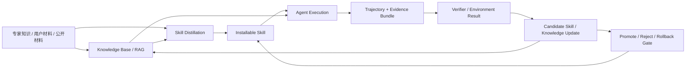

# Expert Skill Distillation Prototype

一个面向 Agent 的研究级原型：把专家知识、用户规则或公开材料组织成 **知识库 / RAG + 可安装 Skill + 执行轨迹** 的混合系统。固定、可迁移的流程被蒸馏成 Skill；动态、长尾、案例型内容保留在知识库中检索；真实执行轨迹再反过来验证、修订和补充这两层。

它真正想解决的不是“再写一个 prompt 仓库”，也不是让 Skill 替代 RAG，而是三件更底层的事：

1. 能不能区分哪些知识适合固化为 Skill，哪些知识仍应动态检索？
2. 能不能把可固化材料自动蒸馏成真正可运行的 Skill package？
3. 能不能让 Skill 的升级、拒绝、回滚都由同一条 evidence / trajectory 证据链驱动？

## 我们真正做的是什么

这个仓库的核心已经从单一路线升级为一个三层闭环：

- **Knowledge Base / RAG**：保存动态事实、长尾案例、背景材料和具体异常处理经验
- **Skill**：固化稳定、可迁移、可复用的 how-to 流程
- **Trajectory**：记录 Agent 的真实执行、工具调用、失败和修复结果，用来验证 Skill，也反哺知识库



换句话说，这里研究的是：

> 哪些知识应该被固化为 Skill，哪些知识应该留在 RAG 中动态检索，以及轨迹能不能把两者持续连成一个可验证的学习闭环。

更完整的方向说明见：[docs/HYBRID_KNOWLEDGE_SKILL_TRAJECTORY_ARCHITECTURE.md](docs/HYBRID_KNOWLEDGE_SKILL_TRAJECTORY_ARCHITECTURE.md)。

## 当前最强的证据

### 1. Runtime 主闭环已经成型

仓库现在已经具备真实可运行的主链：

```text
材料 -> 蒸馏为 Skill package -> install 到 runtime
-> 在任务中执行 -> evidence bundle + verifier feedback
-> candidate Skill -> promote / reject / rollback gate
```

这意味着 Skill 在这里已经不只是静态 prompt，而是一个可安装、可调用、可比较、可回滚的运行对象。

### 2. bounded open-world 自动蒸馏已经有支持性证据

我们新增了 `hybrid_semantic` 蒸馏路径：

- 先用 LLM 在公开材料上做 capability 语义选择
- 如果某条材料上模型保守 abstain，再显式记录 provenance 后退回 keyword projection
- 整个过程都保留 fallback 证据，不伪装成纯语义成功

当前这条线最值得看的两条结果是：

- 一次 fresh run：`8 / 10` effective pass，对比 baseline `7 / 10`
- 最新 fresh rerun：`8 / 10` effective pass，与 baseline `8 / 10` 持平

这说明在当前有界公开材料场景里，系统已经能**自动蒸馏出接近现有安装版基线、并且一度超过基线**的 Skill。

对应报告：

- [reports/OPEN_WORLD_DISTILLATION_VALIDATION_STATUS.md](reports/OPEN_WORLD_DISTILLATION_VALIDATION_STATUS.md)

### 3. bounded evolution 已经拿到更真实的改进证据

我们不再只做“模板追加段落”，而是让 `live_semantic` candidate 直接改写 capability section 本体，再和 base skill 做严格比较。

当前最强的两层证据是：

- 一次 fresh generated-candidate run：`3 / 3` strict promotion proposals
- 一次 frozen-candidate repeatability run：`4 / 5` strict promotion proposals，平均分差 `+0.0333`

这个 frozen candidate 是把一次成功的 live semantic candidate 冻结下来，再做多轮 live 重复验证。它没有做到“每一轮都严格更优”，但已经给出更强的 bounded repeatability 证据：

- `promotion_count = 4 / 5`
- `base_mean_score = 0.9167`
- `candidate_mean_score = 0.95`
- `mean_score_delta = +0.0333`
- `false_positive_delta = 0`

对应报告：

- [reports/OPEN_WORLD_CLOSED_LOOP_STATUS.md](reports/OPEN_WORLD_CLOSED_LOOP_STATUS.md)

### 4. teaching-utility v0.2 保留了负结果

这条线问的不是“哪条轨迹能让当前任务分数更高”，而是：

> 哪条轨迹更适合教出下一个更好的 Skill？

当前更严格的 matched-budget live pilot 里，sealed hidden test 已经被拆到独立脚本中，在方法和 Skill hash 冻结后首次访问：

- `active_discriminative_evidence` 仍未严格赢过 contrast / diversity
- 当前独立 sealed hidden 结论是 `active_selection_hypothesis = inconclusive`
- hidden teaching utility 暂时是 flat signal

这条负/不确定结果没有被硬拗成成功，反而说明这个仓库会保留真实失败，而不是只堆好看的数字。

对应报告：

- [reports/TEACHING_UTILITY_V02_STATUS.md](reports/TEACHING_UTILITY_V02_STATUS.md)

## 你可以直接用它做什么

### 路径 A：直接跑仓库内置 Skill

```powershell
python -m pip install -e .[dev]
skill-deploy build-codex-skill
skill-deploy install --skill outputs/deployable_codex_skill/secure_code_review --version v2
skill-deploy run-skill --installed secure_code_review --case upload_security_001 --backend offline_deterministic
```

### 路径 B：从你自己的材料蒸馏一个 Skill

```powershell
skill-deploy distill-open-materials --materials demo/open_materials_example.json --skill-id my_distilled_skill --version v1 --projection-mode hybrid_semantic --base-url https://api.deepseek.com --model deepseek-v4-flash
skill-deploy install --skill outputs/distilled_open_materials/my_distilled_skill --version v1
skill-deploy run-skill --installed my_distilled_skill --case upload_security_001 --backend offline_deterministic
```

### 路径 C：比较 Skill 版本是否真的带来净收益

```powershell
skill-deploy compare-variants --cases upload,config --backend offline_deterministic --source installed --installed-skill secure_code_review
```

### 路径 D：跑 bounded open-world 蒸馏 + 演化

```powershell
$env:OPENAI_API_KEY = "<your key>"
skill-deploy open-world-distill-validation --skill-id secure_code_review_open_world_hybrid_distilled --version v1 --backend live_llm_text --base-url https://api.deepseek.com --model deepseek-v4-flash --projection-mode hybrid_semantic
skill-deploy open-world-closed-loop --installed secure_code_review_open_world_hybrid_distilled --repeats 5 --base-url https://api.deepseek.com --model deepseek-v4-flash --candidate-mode live_semantic --reuse-candidate-dir outputs/open_world_closed_loop/frozen_candidate_config_guard_v1
```

## 如果你第一次进仓库

建议只先看这几个文件，不需要一口气翻完整个目录：

1. `README.md`
2. [docs/USER_MANUAL_ZH.md](docs/USER_MANUAL_ZH.md)
3. [docs/PROJECT_GUIDE_ZH.md](docs/PROJECT_GUIDE_ZH.md)
4. [docs/CLAIM_BOUNDARY.md](docs/CLAIM_BOUNDARY.md)
5. [docs/HYBRID_KNOWLEDGE_SKILL_TRAJECTORY_ARCHITECTURE.md](docs/HYBRID_KNOWLEDGE_SKILL_TRAJECTORY_ARCHITECTURE.md)
6. [reports/OPEN_WORLD_DISTILLATION_VALIDATION_STATUS.md](reports/OPEN_WORLD_DISTILLATION_VALIDATION_STATUS.md)
7. [reports/OPEN_WORLD_CLOSED_LOOP_STATUS.md](reports/OPEN_WORLD_CLOSED_LOOP_STATUS.md)
8. [reports/TEACHING_UTILITY_V02_SEALED_HIDDEN_STATUS.md](reports/TEACHING_UTILITY_V02_SEALED_HIDDEN_STATUS.md)
9. [reports/TEACHER_PROGRESS_BRIEF_20260616.md](reports/TEACHER_PROGRESS_BRIEF_20260616.md)

## 目录导览

```text
src/skill_deployment/   runtime、distillation、install state、verifier、CLI
agents/                 live / local agent 执行器
scripts/                入口脚本、实验脚本、导出脚本
data/                   controlled cases、holdout、公开材料验证样本
demo/                   最小材料示例
outputs/                distilled skills、installed skills、runtime evidence、pilot 结果
reports/                阶段报告、claim 校准、实验结论
docs/                   用户说明、项目说明、边界说明
review_package/         对外评审材料
```

## 当前不能声称什么

这个仓库现在**不能**诚实声称：

- 生产级漏洞扫描器
- exploit 生成或攻击链执行工具
- 任意 open-world 材料上都能稳定自动蒸馏
- evolution 已经在广泛任务上稳定产出更优 Skill
- Skill-only 已经证明优于 RAG-only
- Skill + RAG + trajectory 混合结构已经拿到官方 benchmark 结论
- 官方 CyberSecEval / AutoPatchBench / CVE-Bench / SWE-bench 成绩

当前最准确的说法是：

> 这是一个 Evidence-Grounded Skill Evolution Runtime 的研究级原型。  
> 它已经拿到 bounded open-world 自动蒸馏和 bounded evolution improvement 的支持性证据，  
> 但这些证据仍然是有界、本地、可审计的，不等于官方外部 benchmark 或通用真实世界能力。

## 基础校验

```powershell
python -m pytest -q
python scripts\validate_task_cases.py
skill-deploy validate-review-package
```

## License

MIT
