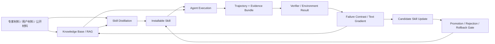

# Hybrid Knowledge, Skill, and Trajectory Architecture

本文件记录 2026-06-16 的方向更新：项目不应被理解成“只做 Skill”或“只做 RAG”，而应推进为一个 **知识库 / Skill / 轨迹** 三层协同系统。

## 1. 新的系统定位

当前更准确的定位是：

> Evidence-Grounded Skill Evolution Runtime with a hybrid Knowledge Base + Skill + Trajectory loop.

也就是说，系统的核心问题不是把所有知识都塞进 Skill，而是判断：

- 哪些内容应该固化为可执行的 how-to Skill；
- 哪些内容应该保留在 RAG / 知识库中动态检索；
- 哪些执行轨迹应该沉淀为新的案例、反例、修复经验或 Skill 更新证据。

## 2. 三层分工

### Knowledge Base / RAG

知识库负责保留动态、长尾、事实型和案例型内容。

适合放入知识库的内容包括：

- 易变事实，例如版本、API 行为、漏洞公告、依赖状态；
- 大量案例，例如真实漏洞报告、历史修复记录、失败日志；
- 背景材料，例如标准、设计文档、论文、博客、团队经验；
- 不适合压缩成固定步骤的上下文。

RAG 的作用不是替代 Skill，而是在执行时补充具体场景知识。

### Skill

Skill 负责固化稳定、可迁移、可复用的 how-to 流程。

适合固化为 Skill 的内容包括：

- 稳定审计流程；
- 输出契约；
- 工具调用顺序；
- 失败恢复策略；
- 判断边界和禁用项；
- 从多条轨迹中归纳出的可迁移操作经验。

Skill 不应该承担所有记忆。Skill 越写越长、越像案例库，通常意味着边界设计出了问题。

### Trajectory

轨迹记录 Agent 在真实任务中的行为、工具调用和结果，是连接 RAG 与 Skill 的实验数据。

轨迹至少有三种用途：

- 验证 Skill 是否真的能完成任务；
- 反向提炼成功/失败经验，形成候选 Skill 更新；
- 进入知识库，成为后续 RAG 可以检索的案例。

轨迹不是天然等于 Skill。高奖励轨迹也不一定有高 teaching utility，这正是 v0.2 pilot 正在验证的问题。

## 3. 闭环关系

这个闭环里，RAG、Skill 和 trajectory 是相互滋养的：

- 知识库给 Skill 蒸馏提供材料；
- Skill 给 Agent 执行提供稳定流程；
- 执行轨迹给知识库补充案例，也给 Skill 更新提供证据；
- verifier 和 benchmark 决定更新能否晋升。

## 4. 与传统 RAG 的区别

传统 RAG 更偏向“检索相关内容，然后让模型临场组织答案”。本项目希望进一步回答：

- 能否把稳定流程从 RAG 材料中蒸馏为 Skill；
- Skill 是否比每次多轮检索更稳定、更准确、更低成本；
- 什么时候不应该固化，仍应保留动态检索；
- 轨迹如何反过来更新 Skill 和知识库。

因此合理方向不是 Skill 替代 RAG，而是 Skill + RAG 的混合结构。

## 5. 与 SFT / RL 讨论的关系

讨论中提到 SFT 和强化学习的差异，本项目里的类比是：

- 单条成功轨迹类似单个高奖励样本，不应直接写进 Skill；
- Skill 更新更像分布控制问题，而不只是 loss 或 reward 最大化；
- 需要固定任务分布、预算、工具调用、token 和 hidden test，才能判断更新是否真的泛化；
- 被拒绝的 candidate 也是重要证据，不应包装成成功。

因此 evolution 不能只学“最优轨迹”。它必须通过多轨迹归纳、失败对比、验证集门控和 sealed hidden test 来约束。

## 6. 对 benchmark 的影响

下一步 benchmark 设计必须同时评价三件事：

1. 单纯 RAG / 知识库检索是否足够；
2. Skill 化是否比 RAG-only 更稳定或更低成本；
3. RAG + Skill + trajectory feedback 是否优于任一单一路线。

当前本地证据还不足以支撑这些外部结论。验证器也仍需继续成熟，所以 benchmark 阶段要避免把内部 verifier 当成官方 evaluator。

## 7. 对场景选择的影响

讨论中提到漏洞挖掘比问答更适合观察轨迹，因为它有更明确的执行行为、工具调用和环境反馈。这个判断和当前项目方向一致。

同时，多智能体“轨迹编排”是一个有价值的后续方向，但当前优先级仍应是：

1. 在垂直场景里跑通可观察、可验证的单/少量 Agent 轨迹；
2. 明确哪些轨迹能教出可迁移 Skill；
3. 再扩展到多智能体节点式轨迹编排。

## 8. 当前不能声称什么

本方向更新不等于以下结论已经成立：

- 已经证明 Skill + RAG 混合系统优于 RAG-only；
- 已经完成官方 benchmark；
- 已经证明 active trajectory selection 优于 contrast/diversity；
- 已经证明 evolution 稳定产出更优 Skill；
- 已经具备真实漏洞挖掘产品能力。

当前能说的是：

> 项目已经从单纯 Skill runtime 进一步明确为 Knowledge Base + Skill + Trajectory 的混合研究原型。现有代码已支持 Skill 蒸馏、执行、证据、候选更新和部分负结果保存；下一阶段需要用 benchmark 和更严格 evaluator 验证混合结构是否真的带来收益。

