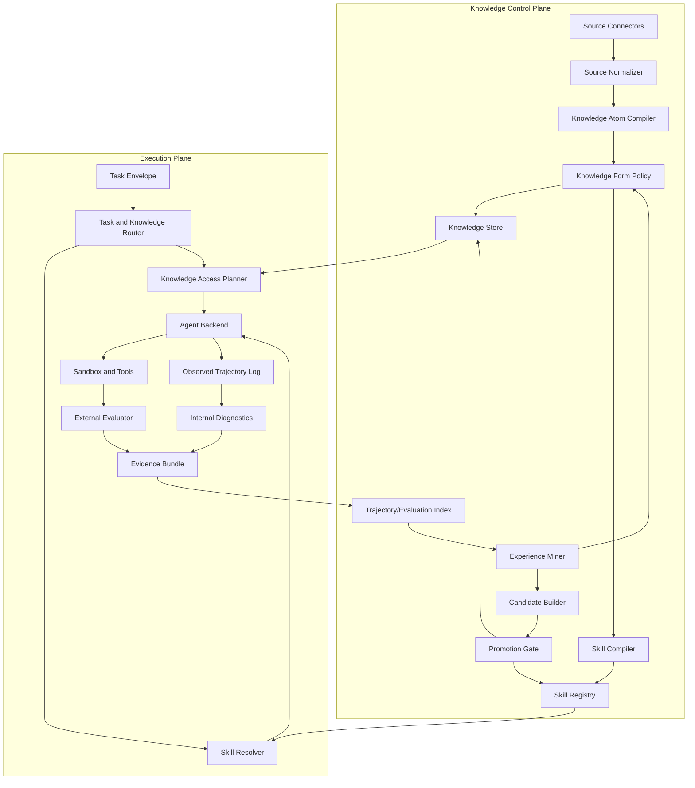

# v0.2 Architecture Options

## 1. 设计约束

候选架构必须同时满足：

- 通用核心不依赖安全 capability id；
- 安全场景可以提供代码搜索、CVE/版本查询、沙箱和 evaluator；
- Skill、Knowledge、Trajectory 是不同对象，不能只靠一个 `metadata` 字典区分；
- 内部 verifier 负责诊断，外部环境结果负责最终任务判断；
- 每次检索、执行、更新和晋升均可追溯；
- 允许先用文件/SQLite 做 MVP，不提前绑定向量数据库；
- 多 Agent、GraphRAG 和在线 RL 都不是 v0.2 前置条件。

## 2. 方案 A：双平面、类型化存储、单 Agent 主干（推荐）

### 核心思想

把系统分成两个平面：

1. **Knowledge Control Plane**：负责接入、知识形态决策、版本、索引、Skill 编译、候选更新和 promotion。
2. **Execution Plane**：负责具体任务路由、Skill 解析、主动知识访问、工具执行、轨迹记录和 evaluator。



### 关键性质

- Skill 可以规定检索策略，但不能把检索结果伪装成稳定规则；
- Knowledge Access 是 provider 接口，可连接 BM25、repo search、API、数据库或长上下文；
- router 输出显式 `Skill / Retrieval / Both / None` 决策和原因；
- trajectory 是 append-only observed event，报告摘要不能覆盖原始轨迹；
- evaluator 与 diagnostic verifier 分离；
- security 只作为 adapter 注入任务 taxonomy、工具和 evaluator。

### 优点

- 与现有 Skill registry、runner、evidence、gate 的迁移距离最短；
- 可在不引入数据库的情况下先冻结接口；
- 适合做清晰 ablation；
- 通用核心和 security adapter 边界明确。

### 缺点

- 初期 routing policy 会比较朴素；
- 多来源知识一致性需要额外处理；
- 单 Agent 主干暂时不覆盖复杂多 Agent 轨迹编排。

## 3. 方案 B：事件溯源的 Artifact Graph / Blackboard

### 核心思想

把所有 Source、Atom、Skill、Trajectory、Evaluation、Candidate 和 Decision 表示为不可变节点，通过有类型的边记录派生关系：

```text
derived_from / retrieved_for / executed_with / contradicted_by
validated_by / supersedes / retired_by / promoted_from
```

运行时 Agent 和多个专业角色共同向 blackboard 写事件，物化视图提供 Skill Registry、Knowledge Store 和 Trajectory Store。

### 优点

- provenance、版本和双向关系最自然；
- 适合未来多 Agent 轨迹编排；
- 能表达同一知识在不同时间/环境下的冲突；
- 容易做审计和时间旅行。

### 缺点

- 实现与运维成本最高；
- 容易过早滑向 GraphRAG 或图数据库选型；
- 当前任务规模不足以证明图结构收益；
- 对现有文件型 Runtime 的迁移较重。

### 判断

它适合作为长期数据模型方向，不适合作为第一阶段 Runtime 实现。v0.2 可以借用其不可变事件和 typed relation 思想，但不应立刻部署图数据库。

## 4. 方案 C：Skill Registry + Retrieval Sidecar 的最小双记忆

### 核心思想

保留当前 Runtime，只新增一个只读 `KnowledgeAccess` sidecar：

```text
Task -> rule-based router -> installed Skill
                         -> optional retrieval sidecar
-> existing Agent/Verifier/Evidence path
```

Knowledge Store 先用文档目录 + SQLite FTS5，trajectory 只把经过审核的 case summary 写入检索库。

### 优点

- 改动小，最快形成 RAG-only / Skill-only / Both 对照；
- 便于验证“是否值得继续做混合结构”；
- 不影响现有安装和 rollback。

### 缺点

- 形态决策仍然浅；
- trajectory 到知识/Skill 的更新容易继续散落在脚本中；
- 若不先冻结契约，sidecar 会退化为 prompt 拼接。

### 判断

方案 C 适合作为方案 A 的第一个 MVP 切片，不适合作为最终架构。

## 5. 方案比较

| 维度 | 方案 A 双平面 | 方案 B Artifact Graph | 方案 C Retrieval Sidecar |
|---|---|---|---|
| 与现有仓库兼容 | 高 | 低 | 最高 |
| 通用核心/领域分离 | 高 | 高 | 中 |
| provenance 表达 | 高 | 最高 | 中 |
| 主动多轮检索 | 支持 | 支持 | 有限 |
| 多 Agent 编排 | 后续支持 | 原生适合 | 不适合 |
| 实验可归因 | 高 | 中 | 高 |
| MVP 成本 | 中 | 高 | 低 |
| 过度设计风险 | 中 | 最高 | 中 |
| 推荐位置 | 目标架构 | 长期研究选项 | 第一阶段实现切片 |

## 6. 推荐架构

推荐冻结方案 A，实施时先落方案 C 的最小切片。

即：

```text
目标架构 = 双平面 + 类型化契约 + provider adapters
首个 MVP = 一个只读 Knowledge Access provider + 显式四路 router + 现有 Skill Runtime
```

这样既不会把当前项目重写成 RAG 平台，也不会把 RAG 变成 prompt 前缀。

## 7. 通用核心与 Security Adapter

### 通用核心

- Source/Atom/Task/Trajectory/Evaluation contracts；
- Knowledge Form Policy；
- Skill Registry 与 Knowledge Access 接口；
- Agent Backend 与 Tool Provider 接口；
- Evidence Bundle、provenance、version、promotion/rollback；
- experiment assignment 与 leakage boundary。

### Security Adapter

- security task taxonomy；
- capability vocabulary 与 report schema；
- `rg`、AST、LSP/SCIP、dependency manifest、CVE/advisory provider；
- defensive sandbox policy；
- patch/test/SAST/benchmark-native evaluator；
- 禁止 exploit、攻击链和未授权目标的 policy。

核心 Runtime 不得 import security capability registry；security adapter 可以 import 核心 contracts。

## 8. 多 Agent 的位置

多 Agent 轨迹编排是后续选项，不是当前缺口的直接答案。只有当单 Agent + 原生工具在以下方面出现稳定瓶颈时才引入：

- 检索、分析、验证需要不同上下文隔离；
- 并行仓库区域分析有可测收益；
- aggregation 能由外部 evaluator 验证；
- 通信成本和错误传播有明确记录。

在此之前，多 Agent 只会放大 trajectory schema 和 attribution 的复杂度。

## 9. 编码前必须冻结

1. Source、Knowledge Atom、Agent Profile、Task、Trajectory、Evaluation 的 schema；
2. 长期 `Skill / Retrieval / Both / Trajectory-only / Discard` 与运行时 `Skill / Retrieval / Both / None` 两级决策；
3. Agent-visible 与 evaluator-only 的字段边界；
4. Knowledge Access provider 和 Retrieval Receipt 接口；
5. observed/synthesized/replay 轨迹分类；
6. internal diagnostic 与 external evaluator 的优先级；
7. core 与 security adapter 的依赖方向；
8. 第一批任务分层和实验预算。

这些未冻结前，不应选向量数据库或改写核心 Runtime。
