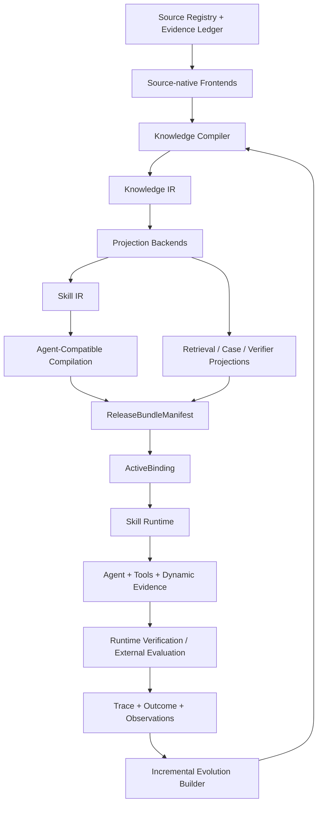

# System Architecture Freeze v1

更新日期：2026-06-20

状态：`frozen_for_v1_specification_and_implementation`

规范级别：本文件是 v1 实现的架构基线。`docs/design_v02/` 保留为预研记录；当两者冲突时，以本文件为准。

实现状态：`target_design_not_yet_implemented`

## 0. 文档目的与主张边界

本文件冻结专家知识蒸馏系统 v1 的系统边界、对象所有权、核心不变量、部署事务和首条纵向验证任务。冻结的目标不是提前宣称系统已经具备这些能力，而是停止继续扩张概念，让后续 schema、ADR、迁移和实现共享同一组约束。

当前仓库已经具备 Skill Package、安装、active pointer、Evidence Bundle、BackendRunner、候选、门控和回滚等原型能力，但尚未实现本文件定义的完整 Knowledge Compiler、Knowledge IR、ReleaseBundle artifact closure 或 Python 依赖安全公告适用性纵向闭环。

本文件冻结后，v1 不再加入以下内容：

- GraphRAG；
- 多智能体编排；
- 在线强化学习、VoI 或 contextual bandit；
- 通用 Pass Manager 或工作流 DSL；
- 自动语义影响分析；
- 每任务 LLM 重编译 Runtime Skill；
- 自动冲突裁决；
- 开放式漏洞发现或 exploit；
- 自动漏洞修复。

## 1. 系统定位

本项目不是 RAG 平台，也不是 Skill 文件管理器。它是：

> 一个以专家知识提取、归纳、合成和 Skill 编译为核心，以源原生知识访问支撑动态任务，以真实执行轨迹和外部验证驱动安全演化的专家知识蒸馏系统。

系统采用统一范式：

```text
Evidence-grounded Knowledge Compiler
+ Skill Runtime
+ Incremental Evolution Builder
```

三大子系统的关系是：

- Knowledge Compiler 建设能力：将异构专家材料与环境证据构造成可验证知识，并编译为 Skill 和其他投影；
- Skill Runtime 服务能力：消费冻结的 Skill 工件和动态证据完成实际任务；
- Incremental Evolution Builder 学习与治理能力：将新来源、执行观测和人工反馈重新送回同一构建管线，生成候选版本并安全晋升或拒绝。

## 2. V1 目标与非目标

### 2.1 V1 必须证明

1. 专家规范能够经过来源理解、知识提取、合成和验证形成 Knowledge IR。
2. Knowledge IR 能够投影为 Skill IR，并编译为 Agent 可使用的稳定工件。
3. Runtime 能在冻结 ReleaseBundle 下执行任务，并将动态查询结果保存为 session evidence。
4. Knowledge Compiler 相比一次性 `direct_to_skill_ir` 是否具有可测量的收益。
5. 来源变化能依据显式 provenance 和 dependency 触发保守增量重建。
6. 候选 Bundle 能够被接受、拒绝，并能执行完整 Bundle rollback。

### 2.2 V1 不证明

- 通用开放世界知识蒸馏已经成立；
- 任意领域、任意 Agent 或任意来源都能泛化；
- 公告适用意味着漏洞真实可达或可利用；
- 系统已经完成自动语义影响分析；
- 系统已经能自动修复漏洞；
- 自主进化能够长期稳定收敛。

## 3. 架构原则

### 3.1 编译器不是确定性真理机器

知识编译包含三类变换：

| 变换类型 | 示例 | 输出约束 |
|---|---|---|
| 确定性变换 | 文件解析、AST、schema、hash、格式转换 | 可重放，结果稳定 |
| 近确定性语义提取 | 明确规则、前提、工具要求、章节结构 | 必须绑定来源 |
| 非确定性归纳 | 从案例或轨迹归纳策略、范围与恢复原则 | 只能先产生候选或假设 |

Knowledge Compiler 不承诺所有变换语义保持。它通过 provenance、证据充分性、独立验证和 promotion gate 管理不确定性。

### 3.2 来源是记录，不是真理

`SourceRecord` 和 `EvidenceUnit` 表示某个来源在某个时间点实际提供了什么，不表示其内容一定正确。来源内容可能过时、冲突、受污染或只适用于特定版本。

### 3.3 原始证据与派生解释分离

```text
Source Snapshot
→ EvidenceUnit / Observation
→ Derived Knowledge
→ Projection Artifacts
```

执行观测是证据；失败归因是 Candidate Diagnosis。归因不能被写成不可变事实。

### 3.4 同源多投影

同一组证据可以产生 Skill、Retrieval、Case、Verifier Candidate 和 Human Review View。投影共享 lineage，但不是同一个对象，也不能独立复制后失去来源关系。

### 3.5 运行时不静默改写 Skill

运行时动态证据只属于当前 session。它可以影响当前决策，但不能在当前 session 内静默修改 Skill、Knowledge IR 或 active Bundle。

### 3.6 外部结果优先

确定性工具、独立测试、外部 evaluator 和权威数据优先于内部 verifier 和模型自评。生成式 verifier 不能成为晋升的唯一依据。

## 4. 总体架构



横切能力：

```text
Provenance
Versioning
Security and Permissions
Observability
Artifact Registry
Policy and Governance
Cost Accounting
```

## 5. 子系统职责

### 5.1 Source Registry 与 Evidence Ledger

中央系统拥有：

- source identity、adapter type、snapshot/version、capture time；
- content hash、permissions、license、retention policy；
- 进入蒸馏、运行和验证过程的不可变 EvidenceUnit；
- runtime query response snapshots 和 execution observations；
- provenance 和 materialization recipe。

Source Adapter 拥有：

- 原生 parser；
- 原生 SourceModel；
- 原生 index；
- provider-specific query logic。

中央系统不复制完整 AST、LSP index、文档树或轨迹数据库，只保存 source snapshot、可审计证据以及能够回到原生模型的安全句柄。

### 5.2 Source-native Frontends

V1 逻辑上支持以下 frontend 类型，但首条纵向任务只实现必要子集：

| Frontend | 原生模型 | 可寻址证据 |
|---|---|---|
| Document | section、list、table、warning、example | TextSpan、TableCell、SectionRef |
| Repository | files、symbols、references、dependencies、tests | CodeRegion、SymbolRef、DependencyRecord |
| Trajectory | action、observation、retry、outcome | RuntimeStep、ToolObservation、VerifierObservation |
| Structured/API | schema、field semantics、time snapshot | StructuredRecord、QueryResponse |
| Expert Feedback | review decision、correction、approval | ExpertAnnotation |

Frontend 输出两类对象：

```text
Adapter-owned Native SourceModel
+
Central Addressable EvidenceUnit
```

### 5.3 Knowledge Compiler

V1 不实现通用 Pass Manager。固定 orchestrator 使用以下阶段：

```text
parse
→ extract
→ bind evidence
→ synthesize
→ validate
→ project
```

每个阶段产生新的不可变 artifact，不在原对象上修改。阶段返回：

```yaml
stage_result:
  status: complete | partial | blocked | rejected
  artifact_refs: []
  issues: []
  evidence_requests: []
  quarantined_item_refs: []
  metrics: {}
  next_action: continue | acquire_evidence | rebuild | human_review | stop
```

阶段语义：

- `extract`：识别来源明确表达的 proposition、procedure、constraint 和 case；
- `bind evidence`：将每条派生知识绑定到可定位 EvidenceUnit；
- `synthesize`：去重、关联正反例、保留冲突、组合程序；
- `validate`：检查忠实性、覆盖、范围、例外和证据充分性；
- `project`：根据形态和用途产生 Skill IR、Retrieval、Case 或 Verifier Candidate。

V1 遇到证据不足或冲突时优先保留冲突、请求额外证据或 quarantine，不做自动真理裁决。

### 5.4 Knowledge IR

Knowledge IR 是准备被系统使用的派生知识模型，不是所有来源必须经过的全量原子化数据库。

V1 最小语义类型：

```text
proposition
procedure
constraint
case
```

最小关系：

```text
derived_from
supports
contradicts
scoped_to
requires
exception_to
validated_by
```

Knowledge 节点状态维度正交：

```yaml
knowledge_node:
  node_id: string
  semantic_type: proposition | procedure | constraint | case
  derivation_mode: explicit | induced | hypothesized
  validation_status: unverified | partial | verified | disputed | invalidated
  eligibility_status: candidate | eligible | quarantined | deprecated | retired
  scope:
    task_families: []
    ecosystems: []
    versions: []
    environments: []
    agent_profiles: []
  freshness:
    observed_at: timestamp
    valid_from: timestamp|null
    valid_until: timestamp|null
    policy_id: string
  modality: must | should | may | must_not
  content: object
  evidence_refs: []
  relation_refs: []
```

约束：

- `derivation_mode=hypothesized` 且未独立验证时，不得成为 active Bundle 的 hard semantic dependency；
- `validation_status=invalidated` 必须触发 impact analysis；
- `eligibility_status=quarantined` 不得进入发布投影；
- scope 扩大必须有新增证据和回归验证；
- freshness 由时间与 policy 动态计算，不依赖手工维护的 `current` 字段。

### 5.5 Projection Backends

Knowledge IR 可以投影为：

- Skill IR；
- Retrieval Projection；
- Case/Episode Projection；
- Candidate Verifier/Test；
- Human Review View。

原生或权威 verifier 只被绑定，不从 Skill 自行生成。由 Skill IR 生成的测试只能先作为 candidate，必须接受独立审查或验证。

### 5.6 Skill IR

Skill IR 使用混合契约：

```text
Declarative Contract
+ Optional Workflow
+ Policy Hooks
```

最小字段：

```yaml
skill_ir:
  skill_family: string
  version: string
  goal: string
  scope: {}
  inputs: []
  outputs: []
  preconditions: []
  required_evidence: []
  optional_evidence: []
  constraints: []
  forbidden_assumptions: []
  exceptions: []
  abstention_conditions: []
  termination_conditions: []
  tool_requirements: []
  side_effects: []
  requested_capabilities: []
  environment_compatibility: []
  dependency_constraints: []
  expected_failure_modes: []
  runtime_budget: {}
  control_semantics: advisory | checklist | partial_order | stateful_workflow
  invocation_mode: prompt_guidance | structured_skill | callable_tool | hybrid
  workflow: null | object
  policy_hooks: []
  verifier_binding_refs: []
  knowledge_node_refs: []
  evidence_refs: []
```

Markdown `SKILL.md` 是 Skill IR 的审计或兼容视图，不是唯一运行真相。

### 5.7 两级 Runtime 编译

第一级：Agent-Compatible Compilation。

```text
Skill IR + AgentProfile + tool schema + policy
→ Agent-Compatible Artifact
```

只有输入版本变化时才重编译。该阶段可以使用 LLM，但必须记录模型、模板、参数、证据顺序、工具版本和环境。

第二级：deterministic Task Binding。

运行时只允许：

- 参数填充；
- Repo/environment 绑定；
- tool schema 和 budget 绑定；
- verifier 绑定；
- permission intersection；
- 动态证据装配。

Task Binding 不得改写 scope、删除例外、扩大权限、重新解释流程或修改安全边界。

### 5.8 Skill Runtime

运行顺序：

```text
Deployment Resolution
→ Skill Resolution
→ Task Binding
→ Dynamic Evidence Acquisition
→ Agent Execution
→ Runtime Verification
→ Session Evidence and Trace
```

Deployment Resolution 根据 tenant、environment、skill family 和 channel 确定 Bundle，必须是确定性的。

Skill Resolution 只能在固定 Bundle 或固定 Bundle 集合内选择 Skill。它可以使用规则、检索或模型，但必须记录候选集合、selector version、输入、分数、选择结果和置信度。

Dynamic Evidence Acquisition 可以自适应调用 Provider，但所有实际影响决策的结果必须在 session 中快照化。

### 5.9 Incremental Evolution Builder

输入：

- source change；
- runtime observation；
- task outcome；
- human feedback；
- verifier change；
- environment or AgentProfile change。

流程：

```text
Observed Evidence
→ Candidate Diagnosis
→ explicit dependency impact proposal
→ conservative rebuild
→ candidate ReleaseBundle
→ regression and safety gate
→ promotion proposal or rejection
```

Evolution Builder 不拥有生产状态，不能直接修改 ActiveBinding。V1 仅使用显式 provenance/dependency；无法确定语义影响范围时扩大重建范围。

## 6. 数据所有权

| 组件 | 拥有 | 不拥有 |
|---|---|---|
| Source Adapter | native parser/model/index/query logic | active Bundle、部署状态 |
| Source Registry | source identity、snapshot、hash、权限、capture metadata | 完整原生索引 |
| Evidence Ledger | immutable evidence、runtime observations、query snapshots、provenance | 来源语义真理 |
| Knowledge Compiler | candidate Knowledge IR、build recipe、diagnostics、validation reports | active deployment state |
| Artifact Registry | immutable artifacts、ReleaseBundleManifest、version、digest | session state |
| ActiveBinding Store | deployment binding、CAS version、rollback target | Bundle 内容 |
| Runtime | session pin、task binding、tool state、append-only trace | Knowledge IR 修改权 |
| Evolution Builder | Candidate Diagnosis、impact/rebuild/promotion proposal | ActiveBinding 修改权 |

## 7. Evidence Retention

Evidence 采用三种保存模式：

```text
embedded
sealed
reference_only
```

每条证据还必须声明：

```yaml
retention:
  mode: embedded | sealed | reference_only
  duration: string|null
  allowed_purposes: []
  access_policy_id: string
  redaction_status: none | partial | full
  deletion_behavior: retain_hash | cascade_invalidate | legal_hold
  replayability: guaranteed | best_effort | unavailable
```

Adapter 拥有完整原生模型，中央拥有不可变来源快照和可审计证据。动态 API 不要求无条件保存完整响应，只保存实际影响决策且符合 retention policy 的内容或规范化子集。

## 8. Dependency Semantics

依赖角色：

```text
semantic_dependency
runtime_dependency
verification_dependency
audit_dependency
refresh_dependency
```

每条依赖边至少包含：

```yaml
dependency:
  from_artifact: string
  to_artifact: string
  role: string
  phases: [build, promotion, runtime]
  criticality: hard | soft | advisory
  freshness_policy_id: string|null
  retention_requirement: string|null
  on_unavailable: use_snapshot | block | abstain | request_refresh
  on_expired: block | abstain | rebuild
  on_revoked: quarantine_bundle | rebuild | human_review
```

暂时不可访问与来源被撤销必须分开处理。强依赖是否满足由 role、phase、criticality、freshness 和 invalidation 共同决定。

## 9. ReleaseBundle 与部署模型

### 9.1 ReleaseBundleManifest

ReleaseBundle 是逻辑部署单元；Manifest 是不可变声明；内容通过 digest 引用。

```yaml
release_bundle_manifest:
  schema_version: release_bundle.v1
  bundle_digest: sha256:...
  skill_family: python_advisory_applicability
  domain_adapter_compatibility: []
  compatible_agent_profiles: []
  knowledge_ir_ref: {artifact_id: string, digest: string}
  skill_ir_refs: []
  agent_artifact_refs: []
  retrieval_projection_refs: []
  promotion_verifier_binding_refs: []
  runtime_verifier_binding_refs: []
  provider_policy_ref: {artifact_id: string, digest: string}
  permission_request_ref: {artifact_id: string, digest: string}
  provenance_manifest_ref: {artifact_id: string, digest: string}
  regression_report_ref: {artifact_id: string, digest: string}
  dependency_manifest_ref: {artifact_id: string, digest: string}
  build_record_ref: {artifact_id: string, digest: string}
```

`deployment channel` 不参与 Bundle identity 或 digest。

`bundle_digest` 的计算对象是移除 `bundle_digest` 字段后的 canonical manifest。canonicalization、字段排序和 hash algorithm 由 schema version 固定，避免自引用 hash 和不同序列化方式产生不同身份。

### 9.2 Bundle 构建记录与部署状态

ReleaseBundle 是不可变内容对象，不拥有全局 `active` 状态。

构建与验证状态记录在 Bundle 外部的 BuildRecord/EvaluationRecord：

```text
built
validated
rejected
```

部署状态记录在 ActiveBinding 和 DeploymentEvent：

```text
promote
supersede
rollback
unbind
```

同一 digest 可以在 development 中 active、在 production 中未部署，也可以在不同 tenant 中具有不同历史。

### 9.3 ActiveBinding

```yaml
active_binding:
  tenant: string
  environment: string
  skill_family: string
  channel: development | staging | production
  bundle_digest: sha256:...
  generation: integer
  previous_bundle_digest: sha256:...|null
  updated_at: timestamp
```

同一 Bundle 可以在不同 tenant/channel 中处于不同部署状态。`active`、`superseded` 和 `rollback_target` 属于 deployment history，不属于 Bundle 内容对象。

### 9.4 Promotion Transaction

```text
build immutable candidate artifacts
→ compute artifact closure and bundle digest
→ validate exact digest
→ stage exact digest
→ CAS(expected_active, candidate_digest)
→ append DeploymentEvent
```

强不变量：

```text
validated digest = staged digest = promoted digest
```

任何字段或依赖变化都产生新 digest 并重新验证。

### 9.5 Rollback Transaction

Rollback 不重新编译近似旧版本，而是将 ActiveBinding 重新绑定原始历史 digest：

```text
CAS(current_bundle=B, target_bundle=A)
→ append rollback DeploymentEvent
```

新 session 使用 A；回滚前已开始的 session 继续 pin 原 Bundle。

## 10. 权限与安全

Bundle 只能声明 `requested_capabilities`，不能授予权限。

```text
effective permission
= platform ceiling
∩ tenant policy
∩ session policy
∩ bundle requested capability
```

约束：

- secret 不进入 Bundle；
- credential 由 Runtime 注入；
- Bundle 只引用 credential scope；
- 权限扩大必须重新审核；
- Runtime 在模型之外强制权限、side effect 和 approval gate；
- evaluator-only oracle 不进入 Compiler、Skill、retrieval index 或 Runtime Agent；
- Security domain semantics 属于 adapter；sandbox、权限、审计和 abstention 属于核心 Runtime。

## 11. 架构不变量

1. 原始 source snapshot 和 runtime observation 只追加，不原地修改。
2. 所有派生产物必须记录 lineage、build recipe 和 execution capsule。
3. 未独立验证的 hypothesized knowledge 不得成为 active Bundle 的 hard semantic dependency。
4. 生成式 verifier 不能成为唯一晋升证据。
5. Runtime session 使用冻结的 Bundle、AgentProfile 和 Provider configuration。
6. 动态查询结果作为 session EvidenceUnit 保存。
7. Candidate Diagnosis 不是事实，必须通过重建与回归验证。
8. ActiveBinding 只能通过 CAS promotion/rollback transaction 修改。
9. 新版本失败不覆盖当前部署版本。
10. 动态事实不得通过 Runtime Skill 重编译静默固化。
11. scope 扩大需要新增证据和回归测试。
12. permission 扩大需要显式人工批准。
13. Runtime guard 必须在模型之外执行。
14. PromotionRecord 必须包含候选 digest、gate、回归、依赖、previous pointer、rollback target、approver 和时间。
15. active Bundle 的 hard dependency closure 必须满足对应阶段政策。
16. candidate、staged 和 promoted 必须是同一 digest。
17. active Bundle 的所有静态投影必须固定且不可原地更新。
18. 运行中 session 不随 ActiveBinding 漂移。
19. Domain primitives 不得封装完整专家决策策略。
20. failed、rejected、blocked 和 unresolved 证据不得删除或改写成成功。

## 12. V1 纵向任务

### 12.1 名称与范围

正式名称：`Python 依赖安全公告适用性判定`。

V1 只判断当前解析出的 package、version 和 environment 条件是否匹配冻结 OSV snapshot 中的 advisory affected range。

输出：

```text
advisory_applicable
advisory_not_applicable
unresolved
```

`advisory_applicable` 不表示代码调用漏洞 API、路径可达、漏洞可利用或项目存在真实安全风险。

### 12.2 输入语法

V1 支持：

- 规范化 Python 包名；
- `name==version`；
- 空行和注释；
- 预注册子集内的 PEP 508 environment marker。

V1 不支持或返回明确状态：

- `>=`、`~=` 等非固定版本；
- VCS URL；
- editable/local path；
- `-r`、`-c`；
- 无法确定版本的依赖；
- 冲突重复 pin；
- 未注册 marker 语法。

区分：

```text
parse_error：输入超出已声明语法或无法解析
unresolved：输入可理解，但证据不足以完成适用性判断
```

### 12.3 两条隔离输入链

知识构建链：

```text
expert review specification
+ OSV schema/documentation
+ build examples
→ Knowledge Compiler
→ Knowledge IR
→ Skill IR
```

任务执行链：

```text
requirements.txt
+ environment profile
+ frozen OSV snapshot
→ Runtime
→ applicability verdict and evidence
```

Compiler 可以看 OSV schema 和构建示例，但不能看到 held-out package/advisory gold verdict。

### 12.4 数据切分

```text
build examples：用于提取和初始构建
development cases：用于冻结前调整 schema、prompt 和规则
held-out evaluation cases：Compiler、Skill 生成和调参过程不可见
```

所有配置和资源包络必须在查看 held-out 结果前固定。

### 12.5 Domain primitives 与专家策略边界

允许确定性工具实现：

- requirements parser；
- PyPI 名称规范化；
- PEP 440 版本比较；
- OSV schema 解析和 frozen snapshot query；
- output schema validation；
- independent deterministic evaluator。

必须由专家规范经蒸馏产生：

- 证据检查顺序；
- 来源优先级；
- 必需证据；
- unresolved 条件；
- 冲突和 environment marker 处理原则；
- 拒绝条件；
- 输出证据要求；
- 停止与验证要求。

### 12.6 五个实验条件

```text
no_skill
full_material
direct_to_skill_ir
compiler_distilled_skill
human_authored_reference_skill
```

诊断问题：

| 条件 | 回答的问题 |
|---|---|
| no_skill | Agent 和确定性工具自身能做到多少？ |
| full_material | 不蒸馏、直接阅读材料是否足够？ |
| direct_to_skill_ir | 一次性直接生成 Skill IR 是否足够？ |
| compiler_distilled_skill | Knowledge IR、多阶段合成和验证是否提供净价值？ |
| human_authored_reference_skill | 自动蒸馏与人工策划 Skill 还有多少差距？ |

`direct_to_skill_ir` 使用相同原始材料、模型和目标 Skill IR schema，随后经过相同 Runtime compiler、Agent artifact 生成器、verifier 和 evaluator。它不使用 Knowledge IR，也不增加独立 extraction/synthesis/validation pipeline。

所有条件共享相同 Agent/model、domain primitives、OSV snapshot、权限、Runtime verifier、held-out cases 和任务执行预算。

`human_authored_reference_skill` 只能看到与自动方法相同的专家材料和 build examples，不能看到 held-out gold。`full_material` 不允许静默截断；若材料超出预注册 context budget，该 case 必须标记为超出适用条件或使用预注册的确定性分段策略。

### 12.7 资源协议

统一资源包络是上限，不要求实际消耗完全相等：

```text
total input tokens <= T_in
total output tokens <= T_out
total API cost <= C
external access count/cost <= R
wall-clock time <= W
```

允许各方法自行分配调用次数和并行度。调用次数、缓存命中、总 elapsed time、关键路径时间、中位数和波动范围作为结果报告。

正式结果分为：

1. `effectiveness`：各方法使用预先固定的正常配置；
2. `budget_matched`：自动方法使用相同总资源上限；
3. `amortized_cost`：计算编译、维护和复用成本。

成本至少包括：

- LLM token/API；
- 外部检索/API；
- index build；
- deterministic tools；
- compilation validation；
- regression；
- incremental rebuild；
- runtime。

独立 evaluator 成本单独报告。人工参考 Skill 单独报告人工编写、审查时间和修改次数，不与 API 美元强行合并。

摊销成本：

```text
C_m(N, K)
= C_compile,m
+ sum(k=1..K) C_rebuild,m,k
+ N * C_runtime,m
```

允许结论为当前范围内不存在有限 break-even。不得强行生成有利交点。

### 12.8 四层评价与系统 Gate

知识构建质量：

- extraction faithfulness；
- coverage；
- scope accuracy；
- conflict awareness；
- procedural completeness；
- evidence quality。

运行质量：

- verdict correctness；
- evidence completeness；
- provenance correctness；
- justified unresolved；
- forbidden evidence usage；
- task latency and cost。

演化质量：

- accepted update 的真实净收益；
- negative control 和旧任务是否退化；
- rejected candidate 是否不污染部署；
- rollback 是否恢复完整 closure。

系统与运维质量：

- build latency；
- incremental rebuild ratio；
- deployment success；
- artifact reproducibility；
- observability；
- failure recovery time。

Promotion 前必须通过不计入算法分数的系统一致性 Gate：

- digest 未改变；
- dependency closure 满足；
- 权限未扩大；
- verifier 固定；
- session pin 正确；
- promotion 原子；
- rollback 可恢复完整 Bundle。

### 12.9 演化验收

```text
A → B：有益来源更新通过并原子晋升
build C：危险更新被拒绝，ActiveBinding 保持 B
B → A：显式执行完整 Bundle rollback
```

A → B 示例：专家规范新增“environment marker 无法判断时必须返回 unresolved”。系统通过显式 `derived_from/supports/dependency` 关系确定受影响范围，保守重建，旧回归、新案例和无关负例均通过后晋升 B。

演化事件使用独立预注册的 evolution cases；主实验 held-out cases 在该过程结束前仍不可用于修改 Compiler、Skill 或 gate。

危险 C 是 `unsafe-update fault injection`，例如把未知版本全部判为 applicable。它用于证明 gate，而不冒充系统自然产生的错误归纳。

Rollback 必须重新绑定原始 A digest，不重新编译近似 A。

## 13. Build 与执行记录

LLM 构建不承诺 Nix 式完全确定性。每次构建必须记录 execution capsule：

```yaml
build_record:
  input_artifact_digests: []
  compiler_version: string
  schema_versions: []
  model_provider: string|null
  model_id: string|null
  prompt_template_hash: string|null
  decoding_parameters: {}
  tool_versions: {}
  retrieval_snapshot_refs: []
  evidence_order_hash: string
  external_api_snapshot_refs: []
  random_seed: number|null
  execution_environment: {}
  output_artifact_digests: []
  cost: {}
  timing: {}
```

内容 hash 发现显式输入变化；V1 不自动推断全部语义影响。未确定影响时采用保守重建。

## 14. 当前仓库迁移映射

以下映射仅表示迁移候选，不表示当前 artifact 已符合新 schema。

| 当前对象/模块 | v1 目标 | 迁移方式 |
|---|---|---|
| `src/skill_deployment/schemas.py::SkillPackage` | legacy Skill artifact / Skill IR compatibility view | migration adapter + validation |
| `SKILL.md`、`manifest.json` | legacy Full/Runtime Skill view | 解析为 candidate Skill IR，不直接认证 |
| `src/skill_deployment/install_state.py` registry/pointer | ActiveBinding prototype | 保留行为，改为 Bundle digest + CAS generation |
| `install_history.jsonl`、`rollback_event.json` | DeploymentEvent | schema migration |
| `src/skill_deployment/evidence.py` | Evidence Ledger writer 基础 | 扩展 source/session/build refs |
| `RunnerContext` | ExecutionSession input | 加入 bundle/session/provider/permission pin |
| `BackendRunner` | Runtime Agent Backend | 保留协议，移除领域耦合 |
| `capability_registry.py` | legacy security adapter baseline | 不进入通用核心 |
| `distillation.py` | bounded compiler prototype | 拆出 frontend/compiler/projection，不宣称开放蒸馏 |
| `verifier.py` | internal/runtime diagnostic verifier | 与 promotion/external evaluator 分离 |
| `gate.py` | promotion gate prototype | 改为 Bundle-level transaction input |
| `trace.py` / trajectory artifacts | EvidenceUnit / ExecutionTrace 候选 | 标注 observed/synthesized/replay 后迁移 |
| `outputs/installed_skills` | prototype registry state | 新目录迁移，不原地改名冒充 Bundle |
| 大量 `scripts/` | experiment and report harness | canonical runtime 逐步收口，避免全部进入 core |

迁移规则：

```text
legacy artifact
→ migration adapter
→ new schema candidate
→ validation
→ optional inclusion in candidate Bundle
```

## 15. Schema 演进与兼容

所有核心对象必须包含 `schema_version`。V1 采用以下规则：

- major version 不兼容时拒绝读取，必须经过显式 migration adapter；
- minor additive 字段只能进入预留 `extensions`，不得改变既有字段语义；
- hash 使用对应 schema version 的 canonical serialization；
- reader 不得静默丢弃影响权限、scope、dependency 或 verification 的未知字段；
- migration 产生新 artifact digest，并保留源 artifact 和 migration record；
- schema 变化是否触发 rebuild 由 dependency manifest 显式声明。

## 16. V1 实施切片

### Slice 0：规格与测试夹具

- 冻结 JSON/YAML schema；
- 冻结 ADR；
- 建立 build/dev/held-out 隔离目录；
- 固定 OSV snapshot、expert specification 和 deterministic evaluator；
- 建立 claim boundary。

### Slice 1：Evidence 基础

- Source Registry；
- Evidence Ledger；
- retention policy；
- pinned requirements frontend；
- OSV snapshot adapter。

### Slice 2：Compiler 核心

- fixed orchestrator；
- Evidence binding；
- minimal Knowledge IR；
- `direct_to_skill_ir` baseline；
- `compiler_distilled_skill` pipeline；
- knowledge-quality validation。

### Slice 3：Skill/Bundle 编译

- Skill IR；
- Agent-Compatible Artifact；
- ReleaseBundleManifest；
- content-addressed artifact registry；
- promotion/runtime verifier bindings。

### Slice 4：Runtime 与 ActiveBinding

- Deployment Resolution；
- Skill Resolution；
- deterministic Task Binding；
- session pin；
- permission intersection；
- dynamic evidence snapshot。

### Slice 5：实验与演化

- 五基线；
- effectiveness/budget-matched/amortized reports；
- A → B accepted update；
- rejected C；
- B → A rollback；
- final claim calibration。

## 17. ADR 索引

后续 ADR 只解释关键取舍，不重复完整 schema：

1. `ADR-001 Compiler-Runtime-Evolution Architecture`
2. `ADR-002 Source Ownership and Evidence Retention`
3. `ADR-003 Knowledge IR and Skill IR Separation`
4. `ADR-004 ReleaseBundle and ActiveBinding`
5. `ADR-005 Runtime Resolution and Task Binding`
6. `ADR-006 Permission Enforcement`
7. `ADR-007 Promotion and Rollback Transaction`
8. `ADR-008 Python Advisory Applicability V1`

## 18. 主要风险与缓解

| 风险 | 失败表现 | V1 缓解 |
|---|---|---|
| LLM 提取幻觉 | IR 包含来源未支持的规则 | evidence binding + faithfulness gate |
| 示例记忆和数据泄漏 | held-out 表现虚高 | build/dev/held-out 隔离与可见性审计 |
| Domain primitive 吞掉专家策略 | no-skill 也能完成全部任务 | 工具/策略边界审查与 no-skill baseline |
| IR 过度复杂 | 实现变成知识平台 | 最小类型、extensions 和真实需求驱动升级 |
| 动态来源漂移 | 同一运行无法复现 | frozen 主实验 + session evidence snapshot |
| 错误归因污染知识 | 一次失败直接修改 Skill | Candidate Diagnosis + rebuild/regression gate |
| Bundle 形式原子但依赖可变 | 验证对象与发布对象不同 | immutable artifact closure + digest equality |
| 权限声明被模型绕过 | 非授权工具或副作用 | Runtime 外部 enforcement 与 capability intersection |
| 离线成本无法摊销 | Compiler 更贵且无长期收益 | effectiveness、budget-matched 和 amortized 分开报告 |
| legacy 产物冒充新能力 | claim 超出真实实现 | migration adapter + validation + claim boundary |

## 19. Freeze 决策

### 17.1 已冻结

- 三大子系统；
- Adapter-owned SourceModel + central Evidence Ledger；
- fixed compiler orchestrator；
- Knowledge IR / Skill IR 两级 IR；
- 同源多投影；
- Agent-Compatible Artifact + deterministic Task Binding；
- ReleaseBundleManifest + ActiveBinding；
- append-only evidence；
- explicit dependency + conservative rebuild；
- Bundle-level regression、promotion、rejection 和 rollback；
- V1 纵向任务、五基线、资源协议和数据隔离。

### 17.2 允许 schema versioning，不冻结完整枚举

- Knowledge IR 的未来节点与边；
- Provider capability；
- StageResult 扩展字段；
- Skill IR 的领域扩展；
- cost/metric 的新增维度。

### 17.3 明确暂缓

- 通用 Pass Manager；
- 自动语义 impact analysis；
- 每任务 LLM Skill 重编译；
- 自动冲突解决；
- GraphRAG；
- 多智能体；
- RL/VoI/bandit；
- 自动漏洞修复。

## 20. 完成后的允许主张

只有在 V1 完成并通过冻结数据、独立 evaluator 和系统一致性测试后，才允许声明：

> 系统能够从隔离的专家规范中构建 Knowledge IR 和 Skill IR，将其作为不可变 ReleaseBundle 发布，并完成 Python 依赖安全公告适用性判定；已声明依赖的来源变化能够触发基于显式 provenance 的保守增量重建，候选 Bundle 通过回归门控后原子晋升，失败候选不会影响当前部署版本，已晋升版本能够作为完整 Bundle 回滚。

不得把该结果表述为开放式漏洞发现、漏洞可利用性证明、自动漏洞修复、通用开放世界蒸馏或长期自主进化收敛。

## 21. Freeze 验收清单

- [ ] 所有 schema 有版本号和 unknown-field policy。
- [ ] Evidence retention 与权限策略可执行。
- [ ] Knowledge IR 和 Skill IR 可分别验证。
- [ ] `direct_to_skill_ir` 与 Compiler 路线共享目标 IR 和 Runtime compiler。
- [ ] build/dev/held-out 无泄漏。
- [ ] effectiveness 与 budget-matched 配置预注册。
- [ ] frozen OSV snapshot 和 evaluator digest 固定。
- [ ] Bundle artifact closure 完整。
- [ ] candidate/staged/promoted digest 一致。
- [ ] ActiveBinding 使用 CAS generation。
- [ ] runtime session pin 不漂移。
- [ ] permission enforcement 位于模型之外。
- [ ] accepted update、rejected candidate 和 explicit rollback 分别通过。
- [ ] legacy 产物只经 adapter 迁移，不改名冒充新能力。
- [ ] 最终报告保留失败、blocked 和 unresolved 证据。

完成以上清单后，才可将 v1 从 `frozen_for_implementation` 更新为 `implemented_and_validated`。
