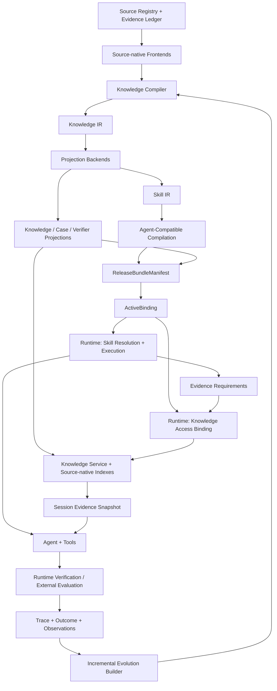

# System Architecture Freeze v1

更新日期：2026-06-21

文档版本：`v1.0.3`

状态：`frozen_for_v1_specification_and_implementation`

规范级别：本文件是 v1 实现的架构基线。`docs/design_v02/` 保留为预研记录；当两者冲突时，以本文件为准。

实现状态：`target_design_not_yet_implemented`

`v1.0.3` 是实现边界校正，不重新打开总体架构。它继承 v1.0.2 对 Skill 与 Knowledge Projection 独立身份及运行时协同的修正，并将 V1 source adapter 收窄到专家文档、requirements 和冻结 OSV，同时用 runtime envelope 区分领域 `unresolved` 与基础设施失败。具体实现技术、初始编译方法和端到端验收分别由本目录中的 Implementation Freeze、Construction Method Spec 和 Walking Skeleton 约束。

## 0. 文档目的与主张边界

本文件冻结专家知识蒸馏系统 v1 的系统边界、对象所有权、核心不变量、部署事务和首条纵向验证任务。冻结的目标不是提前宣称系统已经具备这些能力，而是停止继续扩张概念，让后续 schema、ADR、迁移和实现共享同一组约束。

当前仓库已经具备 Skill Package、安装、active pointer、Evidence Bundle、BackendRunner、候选、门控和回滚等原型能力，但尚未实现本文件定义的完整 Knowledge Compiler、Knowledge IR、ReleaseBundle artifact closure 或 Python 依赖安全公告适用性纵向闭环。

本文件冻结后，v1 不再加入以下内容：

- GraphRAG；
- 多智能体编排；
- 在线强化学习、VoI 或 contextual bandit；
- 通用 Pass Manager 或工作流 DSL；
- 自动语义影响分析；
- 每任务 LLM 重编译 Runtime Skill；
- 自动冲突裁决；
- 开放式漏洞发现或 exploit；
- 自动漏洞修复。

## 1. 系统定位

本项目不是 RAG 平台，也不是 Skill 文件管理器。它是：

> 一个以专家知识提取、归纳、合成和 Skill 编译为核心，以源原生知识访问支撑动态任务，以真实执行轨迹和外部验证驱动安全演化的专家知识蒸馏系统。

系统采用统一范式：

```text
Evidence-grounded Knowledge Compiler
+ Skill Runtime
+ Incremental Evolution Builder
```

三大子系统的关系是：

- Knowledge Compiler 建设能力：将异构专家材料与环境证据构造成可验证知识，并编译为 Skill 和其他投影；
- Skill Runtime 服务能力：消费冻结的 Skill 工件和动态证据完成实际任务；
- Incremental Evolution Builder 学习与治理能力：将新来源、执行观测和人工反馈重新送回同一构建管线，生成候选版本并安全晋升或拒绝。

## 2. V1 目标与非目标

### 2.1 V1 必须证明

1. 专家规范能够经过来源理解、知识提取、合成和验证形成 Knowledge IR。
2. Knowledge IR 能够投影为 Skill IR，并编译为 Agent 可使用的稳定工件。
3. Runtime 能在冻结 ReleaseBundle 下执行任务，并将动态查询结果保存为 session evidence。
4. Knowledge Compiler 相比一次性 `direct_to_skill_ir` 是否具有可测量的收益。
5. 来源变化能依据显式 provenance 和 dependency 触发保守增量重建。
6. 候选 Bundle 能够被接受、拒绝，并能执行完整 Bundle rollback。

### 2.2 V1 不证明

- 通用开放世界知识蒸馏已经成立；
- 任意领域、任意 Agent 或任意来源都能泛化；
- 公告适用意味着漏洞真实可达或可利用；
- 系统已经完成自动语义影响分析；
- 系统已经能自动修复漏洞；
- 自主进化能够长期稳定收敛。

## 3. 架构原则

### 3.1 编译器不是确定性真理机器

知识编译包含三类变换：

| 变换类型 | 示例 | 输出约束 |
|---|---|---|
| 确定性变换 | 文件解析、AST、schema、hash、格式转换 | 可重放，结果稳定 |
| 近确定性语义提取 | 明确规则、前提、工具要求、章节结构 | 必须绑定来源 |
| 非确定性归纳 | 从案例或轨迹归纳策略、范围与恢复原则 | 只能先产生候选或假设 |

Knowledge Compiler 不承诺所有变换语义保持。它通过 provenance、证据充分性、独立验证和 promotion gate 管理不确定性。

### 3.2 来源是记录，不是真理

`SourceRecord` 和 `EvidenceUnit` 表示某个来源在某个时间点实际提供了什么，不表示其内容一定正确。来源内容可能过时、冲突、受污染或只适用于特定版本。

### 3.3 原始证据与派生解释分离

```text
Source Snapshot
→ EvidenceUnit / Observation
→ Derived Knowledge
→ Projection Artifacts
```

执行观测是证据；失败归因是 Candidate Diagnosis。归因不能被写成不可变事实。

### 3.4 同源多投影

同一组证据可以产生 Skill、Retrieval、Case、Verifier Candidate 和 Human Review View。投影共享 lineage，但不是同一个对象，也不能独立复制后失去来源关系。

### 3.5 Skill–Knowledge 分离与运行时协同

Skill 保存稳定、程序性、必须反复遵守的 how-to、证据要求、冲突策略、例外和停止条件；Knowledge Projection 保存具体事实、原文、公告、代码结构、案例和其他大规模或易变化的可查询内容。

`Both` 表示同一来源产生两个独立投影并共享 provenance，不表示把同一段文本无差别复制进 Skill 和检索库。Skill 只声明“需要什么证据以及如何使用”，不写死物理知识库；Knowledge Access Binding 在 Bundle 与 task/session scope 下解析“从哪里、以什么查询契约、使用哪个 snapshot 获取”。

Knowledge Access Service 是 Runtime 内与 Skill Resolution/Execution 并列的逻辑能力，不是第四个顶层真相系统，也不要求实现为网络服务、向量数据库或独立平台。原生索引和查询语义仍由 Source Adapter 拥有，Evidence Ledger 保存实际影响决策的查询快照与 provenance。

### 3.6 运行时不静默改写 Skill

运行时动态证据只属于当前 session。它可以影响当前决策，但不能在当前 session 内静默修改 Skill、Knowledge IR 或 active Bundle。

### 3.7 外部结果优先

确定性工具、独立测试、外部 evaluator 和权威数据优先于内部 verifier 和模型自评。生成式 verifier 不能成为晋升的唯一依据。

## 4. 总体架构



横切能力：

```text
Provenance
Versioning
Security and Permissions
Observability
Artifact Registry
Policy and Governance
Cost Accounting
```

## 5. 子系统职责

### 5.1 Source Registry 与 Evidence Ledger

中央系统拥有：

- source identity、adapter type、snapshot/version、capture time；
- content hash、permissions、license、retention policy；
- 进入蒸馏、运行和验证过程的不可变 EvidenceUnit；
- runtime query response snapshots 和 execution observations；
- provenance 和 materialization recipe。

Source Adapter 拥有：

- 原生 parser；
- 原生 SourceModel；
- 原生 index；
- provider-specific query logic。

中央系统不复制完整 AST、LSP index、文档树或轨迹数据库，只保存 source snapshot、可审计证据以及能够回到原生模型的安全句柄。

### 5.2 Source-native Frontends

V1 逻辑上支持以下 frontend 类型，但首条纵向任务只实现必要子集：

| Frontend | 原生模型 | 可寻址证据 |
|---|---|---|
| Document | section、list、table、warning、example | TextSpan、TableCell、SectionRef |
| Repository | files、symbols、references、dependencies、tests | CodeRegion、SymbolRef、DependencyRecord |
| Trajectory | action、observation、retry、outcome | RuntimeStep、ToolObservation、VerifierObservation |
| Structured/API | schema、field semantics、time snapshot | StructuredRecord、QueryResponse |
| Expert Feedback | review decision、correction、approval | ExpertAnnotation |

Frontend 输出两类对象：

```text
Adapter-owned Native SourceModel
+
Central Addressable EvidenceUnit
```

### 5.3 Knowledge Compiler

V1 不实现通用 Pass Manager。固定 orchestrator 使用以下阶段：

```text
parse
→ extract
→ bind evidence
→ synthesize
→ validate
→ project
```

每个阶段产生新的不可变 artifact，不在原对象上修改。阶段返回：

```yaml
stage_result:
  status: complete | partial | blocked | rejected
  artifact_refs: []
  issues: []
  evidence_requests: []
  quarantined_item_refs: []
  metrics: {}
  next_action: continue | acquire_evidence | rebuild | human_review | stop
```

阶段语义：

- `extract`：识别来源明确表达的 proposition、procedure、constraint 和 case；
- `bind evidence`：将每条派生知识绑定到可定位 EvidenceUnit；
- `synthesize`：去重、关联正反例、保留冲突、组合程序；
- `validate`：检查忠实性、覆盖、范围、例外和证据充分性；
- `project`：根据形态和用途产生 Skill IR、Retrieval、Case 或 Verifier Candidate。

V1 遇到证据不足或冲突时优先保留冲突、请求额外证据或 quarantine，不做自动真理裁决。

### 5.4 Knowledge IR

Knowledge IR 是准备被系统使用的派生知识模型，不是所有来源必须经过的全量原子化数据库。

V1 最小语义类型：

```text
proposition
procedure
constraint
case
```

最小关系：

```text
derived_from
supports
contradicts
scoped_to
requires
exception_to
validated_by
```

Knowledge 节点状态维度正交：

```yaml
knowledge_node:
  node_id: string
  semantic_type: proposition | procedure | constraint | case
  derivation_mode: explicit | induced | hypothesized
  validation_status: unverified | partial | verified | disputed | invalidated
  eligibility_status: candidate | eligible | quarantined | deprecated | retired
  scope:
    task_families: []
    ecosystems: []
    versions: []
    environments: []
    agent_profiles: []
  freshness:
    observed_at: timestamp
    valid_from: timestamp|null
    valid_until: timestamp|null
    policy_id: string
  modality: must | should | may | must_not
  content: object
  evidence_refs: []
  relation_refs: []
```

约束：

- `derivation_mode=hypothesized` 且未独立验证时，不得成为 active Bundle 的 hard semantic dependency；
- `validation_status=invalidated` 必须触发 impact analysis；
- `eligibility_status=quarantined` 不得进入发布投影；
- scope 扩大必须有新增证据和回归验证；
- freshness 由时间与 policy 动态计算，不依赖手工维护的 `current` 字段。

### 5.5 Projection Backends

Knowledge IR 可以投影为：

- Skill IR；
- Retrieval Projection；
- Case/Episode Projection；
- Candidate Verifier/Test；
- Human Review View。

原生或权威 verifier 只被绑定，不从 Skill 自行生成。由 Skill IR 生成的测试只能先作为 candidate，必须接受独立审查或验证。

每个可发布知识节点必须产生可审计的形态决策：

```yaml
projection_decision:
  knowledge_node_ref: {artifact_id: string, digest: string}
  disposition: skill | knowledge | both | none
  reason_codes: []
  skill_projection_refs: []
  knowledge_projection_refs: []
```

基线规则：稳定且程序性的强约束优先进入 Skill；具体、大规模、长尾或易变化事实优先进入 Knowledge Projection；同时需要执行规则与原始解释时选择 `both` 并生成两个独立 artifact；证据不足、无关或被 quarantine 的内容选择 `none`。V1 先使用透明规则和模型建议加自动验证，不声明该形态决策已经由学习算法最优解决。

### 5.6 Knowledge Projection 与 Knowledge Access Service

Knowledge Projection 是面向查询的不可变逻辑工件，不等于复制完整知识库。它可以引用：

```text
document/expert-spec index
structured OSV snapshot
repository dependency/symbol index
case/episode index
trajectory index
versioned API query binding
```

最小契约：

```yaml
knowledge_projection:
  schema_version: knowledge_projection.v1
  projection_id: string
  projection_type: document | structured | repository | case | trajectory | api
  source_snapshot_refs: []
  native_index_refs: []
  query_contract_ref: {artifact_id: string, digest: string}
  result_schema_ref: {artifact_id: string, digest: string}
  provenance_manifest_ref: {artifact_id: string, digest: string}
  freshness_policy_id: string
  access_policy_ref: {artifact_id: string, digest: string}
  materialization_mode: immutable_snapshot | append_only | live_query
```

`native_index_refs` 是指向 Adapter-owned index 的安全、版本化句柄；中央系统不要求复制完整 AST、向量索引或远端数据库。V1 的文档访问使用 section/full read，材料超过预注册上下文阈值后才资格测试 BM25；结构化 OSV 使用冻结 JSON 或 SQLite 查询。Repository adapter 在 V1 只保留接口，不实现 `rg`、AST、调用图或通用 repository index；不引入 GraphRAG、分布式向量库或通用知识平台。

Runtime 通过 `KnowledgeAccessBinding` 将 Skill 的语义证据需求绑定到具体投影：

```yaml
knowledge_access_binding:
  schema_version: knowledge_access_binding.v1
  requirement_id: string
  projection_ref: {artifact_id: string, digest: string}
  provider_adapter_ref: {artifact_id: string, digest: string}
  query_contract_ref: {artifact_id: string, digest: string}
  freshness_policy_id: string
  on_unavailable: block | abstain | use_pinned_snapshot
  result_retention_policy_id: string
```

每次实际查询必须记录 query contract、projection/provider digest、输入 hash、时间、命中 EvidenceUnit、排序/截断信息和原始响应或规范化结果 digest。查询结果是 session evidence，不自动成为 Skill、Knowledge IR 或长期知识；只有后续 Compiler/Evolution 构建事务可以将其转化为候选工件。

### 5.7 Skill IR

Skill IR 使用混合契约：

```text
Declarative Contract
+ Optional Workflow
+ Policy Hooks
```

最小字段：

```yaml
skill_ir:
  skill_family: string
  version: string
  goal: string
  scope: {}
  inputs: []
  outputs: []
  preconditions: []
  required_evidence: []
  optional_evidence: []
  knowledge_requirements: []
  constraints: []
  forbidden_assumptions: []
  exceptions: []
  abstention_conditions: []
  termination_conditions: []
  tool_requirements: []
  side_effects: []
  requested_capabilities: []
  environment_compatibility: []
  dependency_constraints: []
  expected_failure_modes: []
  runtime_budget: {}
  control_semantics: advisory | checklist | partial_order | stateful_workflow
  invocation_mode: prompt_guidance | structured_skill | callable_tool | hybrid
  workflow: null | object
  policy_hooks: []
  verifier_binding_refs: []
  knowledge_node_refs: []
  evidence_refs: []
```

Markdown `SKILL.md` 是 Skill IR 的审计或兼容视图，不是唯一运行真相。

`knowledge_requirements` 只描述证据语义、允许的来源类型、freshness、最低充分性和 unavailable 行为，不包含某个物理数据库地址。相同 Skill IR 可以在不同 Bundle 中绑定不同合规 Knowledge Projection；绑定变化产生新 Bundle digest，但不要求 Skill IR digest 改变。

### 5.8 两级 Runtime 编译

第一级：Agent-Compatible Compilation。

```text
Skill IR + AgentProfile + tool schema + policy
→ Agent-Compatible Artifact
```

只有输入版本变化时才重编译。该阶段可以使用 LLM，但必须记录模型、模板、参数、证据顺序、工具版本和环境。

第二级：deterministic Task Binding。

运行时只允许：

- 参数填充；
- Repo/environment 绑定；
- tool schema 和 budget 绑定；
- verifier 绑定；
- permission intersection；
- 动态证据装配。

Task Binding 不得改写 scope、删除例外、扩大权限、重新解释流程或修改安全边界。

### 5.9 Skill Runtime

运行顺序：

```text
Deployment Resolution
→ Skill Resolution
→ Task Binding
→ Knowledge Access Planning and Binding
→ Dynamic Evidence Acquisition
→ Agent Execution
→ Runtime Verification
→ Session Evidence and Trace
```

Deployment Resolution 根据 tenant、environment、skill family 和 channel 确定 Bundle，必须是确定性的。

Skill Resolution 只能在固定 Bundle 或固定 Bundle 集合内选择 Skill。它可以使用规则、检索或模型，但必须记录候选集合、selector version、输入、分数、选择结果和置信度。

Knowledge Access Planning 只能满足 Skill IR 已声明的 `knowledge_requirements`，不能借检索扩大任务 scope、权限或证据类型。Binding 必须来自当前 Bundle 允许的投影/provider 集合；无法满足 hard evidence requirement 时按契约 block 或 abstain，不允许模型用记忆补齐。

Dynamic Evidence Acquisition 可以在绑定范围内自适应多轮查询 Provider，但所有实际影响决策的结果必须在 session 中快照化。Runtime 返回给 Agent 的每条知识必须可追溯到 Knowledge Projection、Source Snapshot 或动态 QueryResponse。

### 5.10 Incremental Evolution Builder

输入：

- source change；
- runtime observation；
- task outcome；
- human feedback；
- verifier change；
- environment or AgentProfile change。

流程：

```text
Observed Evidence
→ Candidate Diagnosis
→ explicit dependency impact proposal
→ conservative rebuild
→ candidate ReleaseBundle
→ regression and safety gate
→ promotion proposal or rejection
```

Evolution Builder 不拥有生产状态，不能直接修改 ActiveBinding。V1 仅使用显式 provenance/dependency；无法确定语义影响范围时扩大重建范围。

## 6. 数据所有权

| 组件 | 拥有 | 不拥有 |
|---|---|---|
| Source Adapter | native parser/model/index/query logic | active Bundle、部署状态 |
| Source Registry | source identity、snapshot、hash、权限、capture metadata | 完整原生索引 |
| Evidence Ledger | immutable evidence、runtime observations、query snapshots、provenance | 来源语义真理 |
| Knowledge Compiler | candidate Knowledge IR、build recipe、diagnostics、validation reports | active deployment state |
| Knowledge Access Service | projection/binding resolution、query execution metadata、session result refs | 来源真理、Skill 策略、完整原生索引、ActiveBinding |
| Artifact Registry | immutable artifacts、ReleaseBundleManifest、version、digest | session state |
| ActiveBinding Store | deployment binding、CAS version、rollback target | Bundle 内容 |
| Runtime | session pin、task/knowledge binding、tool state、append-only trace | Knowledge IR、Skill IR 或 Knowledge Projection 修改权 |
| Evolution Builder | Candidate Diagnosis、impact/rebuild/promotion proposal | ActiveBinding 修改权 |

## 7. Evidence Retention

Evidence 采用三种保存模式：

```text
embedded
sealed
reference_only
```

每条证据还必须声明：

```yaml
retention:
  mode: embedded | sealed | reference_only
  duration: string|null
  allowed_purposes: []
  access_policy_id: string
  redaction_status: none | partial | full
  legal_hold: true | false
  deletion_action: retain_hash | cascade_invalidate | delete
  replayability: guaranteed | best_effort | unavailable
```

`legal_hold` 是治理状态，不是删除动作。`legal_hold=true` 时不得执行 `deletion_action`；解除 hold 后才按声明动作处理。

Adapter 拥有完整原生模型，中央拥有不可变来源快照和可审计证据。动态 API 不要求无条件保存完整响应，只保存实际影响决策且符合 retention policy 的内容或规范化子集。

## 8. Dependency Semantics

依赖角色：

```text
semantic_dependency
runtime_dependency
verification_dependency
audit_dependency
refresh_dependency
```

每条依赖边至少包含：

```yaml
dependency:
  dependent_ref: {artifact_id: string, digest: sha256:...}
  dependency_ref: {artifact_id: string, digest: sha256:...}
  role: string
  phases: [build, promotion, runtime]
  criticality: hard | soft | advisory
  freshness_policy_id: string|null
  retention_requirement: string|null
  on_unavailable: use_snapshot | block | abstain | request_refresh
  on_expired: block | abstain | rebuild
  on_revoked: quarantine_bundle | rebuild | human_review
```

暂时不可访问与来源被撤销必须分开处理。强依赖是否满足由 role、phase、criticality、freshness 和 invalidation 共同决定。

边方向固定为 `dependent_ref` 依赖 `dependency_ref`。所有 `runtime_dependency` 且 `criticality=hard` 的边必须解析到精确 artifact digest；版本范围或 compatibility 声明只能用于候选解析，不能作为 promotion 或 session pin 的最终身份。

## 9. ReleaseBundle 与部署模型

### 9.1 ReleaseBundleManifest（内容清单）

ReleaseBundle 是逻辑部署单元；`ReleaseBundleManifest` 是不可变内容清单，也称 `BundleContentManifest`。它只引用构成运行语义的内容，不引用针对该 Bundle 运行后才产生的构建、评测或晋升结果。

```yaml
release_bundle_manifest:
  schema_version: release_bundle.v1
  bundle_digest: sha256:...
  skill_family: python_advisory_applicability
  compatible_agent_profiles: []
  knowledge_ir_ref: {artifact_id: string, digest: string}
  skill_ir_refs: []
  agent_artifact_refs: []
  knowledge_projection_refs: []
  knowledge_access_binding_refs: []
  promotion_verifier_binding_refs: []
  runtime_verifier_binding_refs: []
  domain_adapter_ref: {artifact_id: string, digest: string}
  runtime_compiler_ref: {artifact_id: string, digest: string}
  domain_primitive_refs: []
  provider_adapter_refs: []
  schema_bundle_ref: {artifact_id: string, digest: string}
  provider_policy_ref: {artifact_id: string, digest: string}
  permission_request_ref: {artifact_id: string, digest: string}
  provenance_manifest_ref: {artifact_id: string, digest: string}
  dependency_manifest_ref: {artifact_id: string, digest: string}
```

`deployment channel` 不参与 Bundle identity 或 digest。

`bundle_digest` 的计算对象是移除 `bundle_digest` 字段后的 canonical manifest。canonicalization、字段排序和 hash algorithm 由 schema version 固定，避免自引用 hash 和不同序列化方式产生不同身份。

Manifest 中每个 `*_ref` 都必须是精确 digest。`dependency_manifest_ref` 必须枚举并闭包所有 hard runtime dependencies，包括 requirements parser、PEP 440 comparator、OSV adapter 及其传递依赖；上面的 adapter/compiler/primitive/provider/schema 字段是关键依赖的显式索引，不能被 compatibility range 替代。Promotion 与 session pin 都必须验证闭包解析结果与 Manifest 中的精确 digest 一致。

Bundle 固定 Skill、Knowledge Projection、Knowledge Access Binding 和查询语义的身份，不把大型原生知识库整体复制进 Bundle。`immutable_snapshot` 必须固定内容 digest；`live_query` 固定 provider adapter、query/result schema、权限和 freshness policy，并由 session Evidence Ledger 保存实际响应。V1 正式实验只使用 digest 固定的 OSV snapshot；live query 不进入主效果结论。

内容闭包必须是有向无环图：Manifest 引用的 provenance/dependency 子图不得直接或间接引用 `bundle_digest`、BuildAttestation、EvaluationAttestation、PromotionRecord 或 DeploymentEvent。Bundle 级运行证明只能从外部单向指回 `subject_digest`。

### 9.2 Bundle 构建记录与部署状态

ReleaseBundle 是不可变内容对象，不拥有全局 `active` 状态。

构建、验证和晋升证明记录在 Bundle 外部。它们单向引用已经确定的 `bundle_digest`，不得被 Bundle 内容清单反向引用：

```yaml
build_attestation:
  schema_version: build_attestation.v1
  subject_digest: sha256:...
  build_record_ref: {artifact_id: string, digest: string}

evaluation_attestation:
  schema_version: evaluation_attestation.v1
  subject_digest: sha256:...
  evaluator_ref: {artifact_id: string, digest: string}
  evaluation_report_ref: {artifact_id: string, digest: string}

promotion_record:
  schema_version: promotion_record.v1
  subject_digest: sha256:...
  attestation_refs: []
  previous_binding: {bundle_digest: sha256:..., generation: integer}
  rollback_target_digest: sha256:...|null
  approver: string|null
  created_at: timestamp
```

其中 BuildRecord/EvaluationReport 可以包含 Bundle digest 作为输出或评测对象；由于 Bundle 不再引用这些记录，不形成 hash cycle。`promotion_verifier_binding_refs` 留在 Bundle 中，因为它声明“使用哪个 verifier 实现与绑定”，而不是保存 verifier 的运行结果。

候选的外部状态可以是：

```text
built
validated
rejected
```

部署状态记录在 ActiveBinding 和 DeploymentEvent：

```text
promote
supersede
rollback
unbind
```

同一 digest 可以在 development 中 active、在 production 中未部署，也可以在不同 tenant 中具有不同历史。

### 9.3 ActiveBinding

```yaml
active_binding:
  tenant: string
  environment: string
  skill_family: string
  channel: development | staging | production
  bundle_digest: sha256:...
  generation: integer
  previous_bundle_digest: sha256:...|null
  updated_at: timestamp
```

同一 Bundle 可以在不同 tenant/channel 中处于不同部署状态。`active`、`superseded` 和 `rollback_target` 属于 deployment history，不属于 Bundle 内容对象。

`DeploymentEvent` 是部署历史的权威真相源。`previous_bundle_digest` 仅是最近一次事务的便利缓存，不能用于推导完整历史；任意历史 rollback 目标必须从 DeploymentEvent 链解析并校验目标 digest，而不是只允许回退一步。

### 9.4 Promotion Transaction

```text
build immutable candidate artifacts
→ compute artifact closure and bundle digest
→ validate exact digest and exact executable dependency closure
→ issue BuildAttestation/EvaluationAttestation with subject_digest
→ stage exact digest
→ verify attestation subject_digest = candidate_digest
→ CAS(expected_active, candidate_digest)
→ append DeploymentEvent
```

强不变量：

```text
validated digest = staged digest = promoted digest
```

任何内容字段或 hard dependency digest 变化都产生新 Bundle digest 并重新验证。BuildAttestation、EvaluationAttestation 和 PromotionRecord 的新增不改变 Bundle digest。

### 9.5 Rollback Transaction

Rollback 不重新编译近似旧版本，而是将 ActiveBinding 重新绑定原始历史 digest：

```text
CAS(current_bundle=B, target_bundle=A)
→ append rollback DeploymentEvent
```

新 session 使用 A；回滚前已开始的 session 继续 pin 原 Bundle。

## 10. 权限与安全

Bundle 只能声明 `requested_capabilities`，不能授予权限。

```text
effective permission
= platform ceiling
∩ tenant policy
∩ session policy
∩ bundle requested capability
```

约束：

- secret 不进入 Bundle；
- credential 由 Runtime 注入；
- Bundle 只引用 credential scope；
- 权限扩大必须重新审核；
- Runtime 在模型之外强制权限、side effect 和 approval gate；
- evaluator-only oracle 不进入 Compiler、Skill、retrieval index 或 Runtime Agent；
- Security domain semantics 属于 adapter；sandbox、权限、审计和 abstention 属于核心 Runtime。

## 11. 架构不变量

1. 原始 source snapshot 和 runtime observation 只追加，不原地修改。
2. 所有派生产物必须记录 lineage、build recipe 和 execution capsule。
3. 未独立验证的 hypothesized knowledge 不得成为 active Bundle 的 hard semantic dependency。
4. 生成式 verifier 不能成为唯一晋升证据。
5. Runtime session 使用冻结的 Bundle、AgentProfile 和 Provider configuration。
6. 动态查询结果作为 session EvidenceUnit 保存。
7. Candidate Diagnosis 不是事实，必须通过重建与回归验证。
8. ActiveBinding 只能通过 CAS promotion/rollback transaction 修改。
9. 新版本失败不覆盖当前部署版本。
10. 动态事实不得通过 Runtime Skill 重编译静默固化。
11. scope 扩大需要新增证据和回归测试。
12. permission 扩大需要显式人工批准。
13. Runtime guard 必须在模型之外执行。
14. PromotionRecord 必须包含候选 digest、外部 attestation refs、gate、previous binding、rollback target、approver 和时间。
15. active Bundle 的 hard dependency closure 必须解析到精确 digest，并满足对应阶段政策。
16. candidate、staged 和 promoted 必须是同一 digest。
17. active Bundle 的所有静态投影必须固定且不可原地更新。
18. 运行中 session 不随 ActiveBinding 漂移。
19. Domain primitives 不得封装完整专家决策策略。
20. failed、rejected、blocked 和 unresolved 证据不得删除或改写成成功。
21. Skill IR 与 Knowledge Projection 必须具有独立 digest、版本和生命周期；任一方变化不得静默原地改写另一方。
22. Skill 的 `knowledge_requirements` 只声明语义需求；物理来源只能由 Bundle 内固定的 KnowledgeAccessBinding 解析。
23. 影响 verdict 的知识查询必须记录 projection/provider/query/result provenance 并进入 session evidence。
24. hard knowledge requirement 无法满足、过期或越权时必须 block 或 abstain，不得用模型参数记忆替代证据。
25. Runtime 查询结果不得直接写回 Skill、Knowledge IR 或 Knowledge Projection；长期化必须经过新的 Compiler/Evolution 构建事务。

## 12. V1 纵向任务

### 12.1 名称、最小判定单元与输出基数

正式名称：`Python 依赖安全公告适用性判定`。

V1 的最小判定单元固定为一个 `dependency-advisory pair`。每个 task case 提供一个 requirements 文件、environment profile 和一个 advisory id；Runtime 从 advisory 的目标 package 定位对应依赖，并且恰好输出一个 decision。项目级汇总只能由多个 pair decision 聚合，不能复用单个三分类标签代表整个项目。

```yaml
task_case:
  schema_version: python_advisory_case.v1
  task_case_id: string
  requirements_file_ref: {artifact_id: string, digest: sha256:...}
  environment_profile_ref: {artifact_id: string, digest: sha256:...}
  advisory_id: string
  osv_snapshot_ref: {artifact_id: string, digest: sha256:...}
```

输出是带状态的判别联合类型：

```yaml
outcome:
  schema_version: python_advisory_outcome.v1
  task_status: decision | parse_error
  decision:                         # task_status=decision 时必填，否则为 null
    dependency_name: string
    normalized_name: string
    resolved_version: string|null
    advisory_id: string
    verdict: advisory_applicable | advisory_not_applicable | unresolved
    reason_codes: []
    evidence_refs: []
  parse_diagnostics: []             # task_status=parse_error 时非空
```

Domain outcome 外必须有 runtime envelope，避免把基础设施故障伪装成 `unresolved`：

```yaml
execution_envelope:
  execution_status: completed | blocked | runtime_failure
  domain_outcome: object|null
  failure:
    category: string|null
    reason_codes: []
    retryable: boolean|null
  session_id: string
  bundle_digest: sha256:...
```

合法输入但证据不足、未知或冲突属于 `completed + verdict=unresolved`；不支持的输入语法属于 `completed + task_status=parse_error`；hard knowledge requirement 无法按策略满足时属于 `blocked`；Bundle 损坏、Provider crash、Agent timeout 或 schema decode failure 属于 `runtime_failure`。后三者不得混入 pair-level accuracy，也不得改写成 negative decision。

`advisory_applicable` 只表示当前 pair 的 package、version 和 environment 条件匹配冻结 OSV snapshot 中的 affected range，不表示代码调用漏洞 API、路径可达、漏洞可利用或项目存在真实安全风险。

规范化原因码至少包括：

```text
VERSION_IN_RANGE
VERSION_OUT_OF_RANGE
MARKER_FALSE
MARKER_UNKNOWN
PACKAGE_NOT_PRESENT
ADVISORY_NOT_FOUND
VERSION_UNKNOWN
SOURCE_CONFLICT
UNSUPPORTED_INPUT
```

`ADVISORY_NOT_FOUND` 必须导向 `unresolved`，不得解释为 `advisory_not_applicable`。`parse_error` 表示输入不属于已声明语法或无法形成合法 pair；`unresolved` 表示输入可以理解，但证据不足、未知或冲突，二者不得合并。

### 12.2 输入语法

V1 支持：

- 规范化 Python 包名；
- `name==version`；
- 空行和注释；
- 预注册子集内的 PEP 508 environment marker。

V1 不支持或返回明确状态：

- `>=`、`~=` 等非固定版本；
- VCS URL；
- editable/local path；
- `-r`、`-c`；
- 无法确定版本的依赖；
- 冲突重复 pin；
- 未注册 marker 语法。

不属于已声明 grammar 的语法使用 `task_status=parse_error` 和 `UNSUPPORTED_INPUT`；已成功解析但版本、marker、公告或来源证据不足的情况使用 `verdict=unresolved` 及对应原因码。

### 12.3 两条隔离输入链

知识构建链：

```text
expert review specification
+ OSV schema/documentation
+ build examples
→ Knowledge Compiler
→ Knowledge IR
→ Skill IR + Knowledge Projection
```

专家规范中的稳定决策方法进入 Skill IR；规范原文、解释和案例可以进入 Knowledge Projection。冻结 OSV advisory records 作为任务事实由 Structured Source Adapter 直接形成可查询 projection，不要求先改写成 Knowledge IR，也不得固化进 Skill。

任务执行链：

```text
requirements.txt
+ environment profile
+ advisory id
+ frozen OSV snapshot
→ Runtime
→ resolve Skill and KnowledgeAccessBinding
→ query pinned OSV projection
→ one dependency-advisory decision and evidence
```

Compiler 可以看 OSV schema 和构建示例，但不能看到 held-out pair 或其 gold verdict。

### 12.4 数据切分

```text
build examples：用于提取和初始构建
development cases：用于冻结前调整 schema、prompt 和规则
held-out evaluation cases：Compiler、Skill 生成和调参过程不可见
evolution cases：只用于预注册的来源更新与 promotion/rollback 验收
```

所有配置、资源包络和自动评测协议必须在查看 held-out 结果前固定；若报告可选人工参考基线，其作者协议也必须提前固定。

### 12.5 Domain primitives 与专家策略边界

允许确定性工具实现：

- requirements parser；
- PyPI 名称规范化；
- PEP 440 单项比较；
- OSV schema 解析和 frozen snapshot 原始记录查询；
- output schema validation；
- independent deterministic evaluator。

Primitive 只能返回解析事实、原始候选记录和局部比较结果，不能直接封装最终 advisory applicability policy。以下决策必须由专家规范经蒸馏产生：

- 证据检查顺序和来源优先级；
- 哪些证据足以作出肯定或否定结论；
- marker unknown、公告缺失和版本未知时的 abstention；
- 重复 pin、候选记录和来源冲突的处理；
- 拒绝条件、输出证据和停止要求。

### 12.6 预注册正式 case matrix

正式实验必须按现象分层，至少覆盖：

- environment marker 为 true、false 和 unknown；
- 重复 pin 内容一致与相互冲突；
- package 名称规范化边界；
- advisory 存在但 resolved version 未知；
- OSV 记录不完整；
- unsupported syntax 与证据不足导致的 unresolved；
- 肯定、否定与 unresolved 结论各自的必需 evidence；
- advisory 缺失不得产生安全结论；
- 多个候选记录冲突时拒绝武断裁决；
- package 确实不在项目中的负例。

每个现象必须在 development 和 held-out 中有预注册覆盖；case 数量、分层比例和聚合分母在查看 held-out 前冻结。当前仓库既有 8 个 task case 只属于 legacy smoke fixtures，不足以支撑五基线、三分类及 Compiler 优势的正式结论。

#### V1 Skill–Knowledge 协同验收

除任务正确率外，必须通过以下机制测试：

1. 同一 Skill IR/Agent Artifact digest 分别绑定冻结 OSV snapshot A 和 B；Bundle digest 改变，但 Skill digest 保持不变。
2. 仅 advisory snapshot 更新时，显式 dependency impact 只重建 Knowledge Projection、binding 和 Bundle closure；若专家方法未变，不重建 Skill IR。
3. 同一 OSV projection 可被 `no_skill` 与不同 Skill 条件读取，证明知识源不属于单一 Skill。
4. 每个 verdict 能从 Skill requirement 追溯到 KnowledgeAccessBinding、query、EvidenceUnit 和 frozen source record。
5. projection 缺失、过期、越权或 query 失败时输出 `unresolved`/blocked，并保留失败证据，不得从模型记忆补全。
6. Bundle rollback 同时恢复原 Skill、Knowledge Projection 和 binding closure；运行中 session 仍 pin 原版本。

五个主诊断条件共享同一冻结 Knowledge Service 能力。另报告正交机制对照：`knowledge_only = no_skill + knowledge access`、`skill_plus_knowledge = compiler_distilled_skill + knowledge access`；`skill_only_with_required_knowledge_unavailable` 只作为 abstention/false-safe 负控，不作为效果排名条件。

### 12.7 五个实验条件

```text
no_skill
full_material
direct_to_skill_ir
compiler_distilled_skill
human_authored_reference_skill
```

| 条件 | 回答的问题 |
|---|---|
| no_skill | Agent 和确定性工具自身能做到多少？ |
| full_material | 不蒸馏、直接阅读材料是否足够？ |
| direct_to_skill_ir | 一次性直接生成 Skill IR 是否足够？ |
| compiler_distilled_skill | Knowledge IR、多阶段合成和验证是否提供净价值？ |
| human_authored_reference_skill | 自动蒸馏与人工策划 Skill 还有多少差距？ |

`direct_to_skill_ir` 使用相同原始材料、模型和目标 Skill IR schema，随后经过相同 Runtime compiler、Agent artifact 生成器、verifier 和 evaluator。它不使用 Knowledge IR，也不增加独立 extraction/synthesis/validation pipeline。

所有条件共享相同 Agent/model、domain primitives、Knowledge Service、OSV snapshot、权限、Runtime verifier、held-out cases 和任务执行预算。`no_skill` 仍可使用相同知识查询和确定性工具，用于测量 Agent + Knowledge Service 本身的能力；自动方法只能看相同版本的原始材料、schema 文档和 build examples，不能看人工整理的中间结论、另一方法的 Knowledge IR 或 held-out gold。

`human_authored_reference_skill` 是人工策划参考基线，不是理论上界。其协议必须预先固定并记录：

```yaml
human_reference_protocol:
  author_time_limit_hours: number
  dev_case_access: none | read_only_results | interactive
  max_revision_rounds: integer
  reviewer_count: integer
  reviewer_time_limit_hours: number
  freeze_timestamp: timestamp
```

人工作者只能看到与自动方法相同的专家材料和 build examples，不能看到 held-out gold；冻结后不得根据 held-out 结果返工。该条件只作为可选工程参考，不充当 Knowledge IR gold，也不作为 V1 自动评测完成的必要条件。`full_material` 不允许静默截断；若材料超出预注册 context budget，该 case 必须标记为超出适用条件或使用预注册的确定性分段策略。

### 12.8 资源协议

统一资源包络是上限，不要求实际消耗完全相等：

```text
total input tokens <= T_in
total output tokens <= T_out
total API cost <= C
external access count/cost <= R
wall-clock time <= W
```

允许各方法自行分配调用次数和并行度。调用次数、缓存命中、总 elapsed time、关键路径时间、中位数和波动范围作为结果报告。

正式结果分为：

1. `effectiveness`：各方法使用预先固定的正常配置；
2. `budget_matched`：自动方法使用相同总资源上限；
3. `amortized_cost`：计算编译、维护和复用成本。

成本至少包括 LLM/API、外部检索、index build、deterministic tools、compilation validation、regression、incremental rebuild 和 runtime。独立 evaluator 成本单独报告。人工参考 Skill 单独报告人工编写、审查时间和修改次数，不与 API 美元强行合并。

```text
C_m(N, K)
= C_compile,m
+ sum(k=1..K) C_rebuild,m,k
+ N * C_runtime,m
```

允许结论为当前范围内不存在有限 break-even。不得强行生成有利交点。

### 12.9 Automated Source-Grounded Compiler Evaluation

V1 不构造、暗示或声明人工 Knowledge IR gold。知识编译质量由四类自动化证据联合评估；协议、公开数据版本、扰动生成规则、Judge 配置和聚合方式必须在查看 held-out 结果前冻结。

#### A. 确定性结构与来源检查

对每个 Knowledge IR/Skill IR 节点和边执行：

- schema validation 与 unknown-field policy；
- lineage closure 和 dependency direction；
- provenance ref 可解析性、digest 一致性和 source span 存在性；
- claim 到 EvidenceUnit 的绑定完整性；
- scope、modality、exception 与 abstention 字段的结构完整性；
- forbidden held-out visibility 与跨方法 artifact 污染检查。

这些检查只证明结构合法和来源可追溯，不单独证明语义正确。

#### B. 固定独立 LLM-as-Judge 盲评

Judge 输入只包含冻结 source evidence、匿名化候选节点/规则和固定 rubric，不包含方法名称、下游任务分数、promotion 结果或其他候选输出。`direct_to_skill_ir` 与 `compiler_distilled_skill` 的样本随机化顺序并使用不透明 id。

Judge rubric 固定评估：

```text
entailment
unsupported claim
scope overreach
modality mismatch
missing exception
```

必须固定并记录 Judge provider/model、prompt hash、response schema、decoding parameters、重试规则和调用预算；优先使用与生成模型不同的 judge model。Judge malformed/blocked 结果保留为失败或缺失，不做启发式补分。

LLM Judge 是独立模型评测器，不是人工专家、人工 gold 或最终真理来源。报告必须标为 `llm_as_judge`，并与确定性检查和外部任务结果分开呈现。

#### C. 预注册自动扰动测试

在公开冻结 source snapshot 上按固定规则生成不进入构建输入的评测扰动：

- 注入相互冲突的来源或候选记录，检查冲突保留与 abstention；
- 扩大 scope，检查 overreach 检出与拒绝；
- 删除必要 evidence ref，检查缺失证据阻断；
- 标记或替换为过期规则，检查 freshness/invalidation；
- 改变 must/should/may/must_not，检查 modality mismatch。

扰动模板、随机种子、强度分层、预期不变量和评分逻辑必须预注册。扰动的预期结果来自变换本身的机器可判定 invariant，不来自人工 Knowledge IR 标注。

#### D. 公开 held-out benchmark 对照

主效果比较使用冻结公开数据和公开 held-out cases，在相同 Agent、Runtime、domain primitives、权限、OSV snapshot、任务预算和 deterministic evaluator 下比较 `direct_to_skill_ir` 与 `compiler_distilled_skill`。公开数据版本、下载 hash、split manifest 和 evaluator digest 必须固定。

正式报告至少分别给出：

- deterministic schema/lineage/provenance pass rate；
- LLM Judge 的五维结果及 blocked/malformed 数；
- 自动扰动 detection/rejection/abstention rate；
- 公开 held-out pair 的 verdict accuracy、justified unresolved、evidence completeness 和 false-safe rate；
- 两种自动方法的 paired delta、资源消耗与置信区间或 bootstrap 区间。

Compiler 的主收益主张必须由公开 held-out 任务结果和来源约束共同支持，不能只依据 LLM Judge。任务最终正确率也不能替代来源忠实性检查。

### 12.10 四层评价与系统 Gate

知识构建质量由 deterministic source-grounding checks、固定 LLM-as-Judge、自动扰动和公开 held-out 对照联合评估；四类结果必须分列，不得合成一个不可解释的人工加权总分。

运行质量：verdict correctness、evidence completeness、provenance correctness、justified unresolved、forbidden evidence usage、task latency and cost。

Knowledge Access 诊断：requirement-to-binding correctness、query success、snapshot fidelity、evidence hit completeness、ranking/truncation trace、freshness compliance、access denial correctness 和 unavailable 时的 false-safe rate。它们是运行诊断，不替代最终任务 evaluator。

演化质量：accepted update 的真实净收益、negative control 和旧任务是否退化、rejected candidate 是否不污染部署、rollback 是否恢复完整 closure。

系统与运维质量：build latency、incremental rebuild ratio、deployment success、artifact reproducibility、observability、failure recovery time。

Promotion 前必须通过不计入算法分数的系统一致性 Gate：

- Bundle digest 未改变；
- exact executable dependency closure 满足；
- Build/Evaluation Attestation 的 `subject_digest` 等于候选 digest；
- 权限未扩大且 verifier implementation/binding 固定；
- session pin 正确、promotion 原子、rollback 可恢复完整 Bundle。

### 12.11 演化验收

```text
A → B：有益来源更新通过并原子晋升
build C：危险更新被拒绝，ActiveBinding 保持 B
B → A：显式执行完整 Bundle rollback
```

A → B 示例：专家规范新增“environment marker 无法判断时必须返回 unresolved”。系统通过显式 `derived_from/supports/dependency` 关系确定受影响范围，保守重建，旧回归、新案例和无关负例均通过后晋升 B。

演化事件使用独立预注册的 evolution cases；主实验 held-out cases 在该过程结束前仍不可用于修改 Compiler、Skill 或 gate。

危险 C 是 `unsafe-update fault injection`，例如把未知版本全部判为 applicable。它用于证明 gate，而不冒充系统自然产生的错误归纳。C 不得进入任何 ActiveBinding。

Rollback 必须从 DeploymentEvent 解析目标，重新绑定原始 A digest 和完整 artifact closure，不重新编译近似 A。新 session 使用 A，回滚前已运行 session 继续固定原 Bundle。

## 13. Build 与执行记录

LLM 构建不承诺 Nix 式完全确定性。每次构建必须记录 execution capsule：

```yaml
build_record:
  input_artifact_digests: []
  compiler_version: string
  schema_versions: []
  model_provider: string|null
  model_id: string|null
  prompt_template_hash: string|null
  decoding_parameters: {}
  tool_versions: {}
  knowledge_projection_refs: []
  knowledge_access_binding_refs: []
  query_snapshot_refs: []
  evidence_order_hash: string
  external_api_snapshot_refs: []
  random_seed: number|null
  execution_environment: {}
  output_artifact_digests: []
  cost: {}
  timing: {}
```

内容 hash 发现显式输入变化；V1 不自动推断全部语义影响。未确定影响时采用保守重建。

## 14. 当前仓库迁移映射

以下映射仅表示迁移候选，不表示当前 artifact 已符合新 schema。

| 当前对象/模块 | v1 目标 | 迁移方式 |
|---|---|---|
| `src/skill_deployment/schemas.py::SkillPackage` | legacy Skill artifact / Skill IR compatibility view | migration adapter + validation |
| `SKILL.md`、`manifest.json` | legacy Full/Runtime Skill view | 解析为 candidate Skill IR，不直接认证 |
| `src/skill_deployment/install_state.py` registry/pointer | ActiveBinding prototype | 保留行为，改为 Bundle digest + CAS generation |
| `install_history.jsonl`、`rollback_event.json` | DeploymentEvent | schema migration |
| `src/skill_deployment/evidence.py` | Evidence Ledger writer 基础 | 扩展 source/session/build refs |
| `RunnerContext` | ExecutionSession input | 加入 bundle/session/provider/permission pin |
| `BackendRunner` | Runtime Agent Backend | 保留协议，移除领域耦合 |
| `capability_registry.py` | legacy security adapter baseline | 不进入通用核心 |
| `distillation.py` | bounded compiler prototype | 拆出 frontend/compiler/projection，不宣称开放蒸馏 |
| `verifier.py` | internal/runtime diagnostic verifier | 与 promotion/external evaluator 分离 |
| `gate.py` | promotion gate prototype | 改为 Bundle-level transaction input |
| `trace.py` / trajectory artifacts | EvidenceUnit / ExecutionTrace 候选 | 标注 observed/synthesized/replay 后迁移 |
| `outputs/installed_skills` | prototype registry state | 新目录迁移，不原地改名冒充 Bundle |
| 大量 `scripts/` | experiment and report harness | canonical runtime 逐步收口，避免全部进入 core |

迁移规则：

```text
legacy artifact
→ migration adapter
→ new schema candidate
→ validation
→ optional inclusion in candidate Bundle
```

## 15. Schema 演进与兼容

所有核心对象必须包含 `schema_version`。V1 采用以下规则：

- major version 不兼容时拒绝读取，必须经过显式 migration adapter；
- minor additive 字段只能进入预留 `extensions`，不得改变既有字段语义；
- hash 使用对应 schema version 的 canonical serialization；
- reader 不得静默丢弃影响权限、scope、dependency 或 verification 的未知字段；
- migration 产生新 artifact digest，并保留源 artifact 和 migration record；
- schema 变化是否触发 rebuild 由 dependency manifest 显式声明。

## 16. V1 实施切片

### Slice 0：规格与测试夹具

- 冻结 JSON/YAML schema；
- 冻结 ADR；
- 建立 build/dev/held-out 隔离目录；
- 固定 OSV snapshot、expert specification 和 deterministic evaluator；
- 预注册 dependency-advisory pair case matrix、自动扰动和 LLM Judge rubric；
- 固定公开 source/benchmark snapshot、split manifest、deterministic evaluator 和 Judge 配置；
- 若包含可选 human-authored reference，冻结其作者协议；
- 建立 claim boundary。

### Slice 1：Evidence 基础

- Source Registry；
- Evidence Ledger；
- retention policy；
- pinned requirements frontend；
- OSV snapshot adapter；
- minimal Knowledge Projection registry（文件/JSON/SQLite 即可，不建设通用平台）。

### Slice 2：Compiler 核心

- fixed orchestrator；
- Evidence binding；
- minimal Knowledge IR；
- `skill | knowledge | both | none` projection decision；
- `direct_to_skill_ir` baseline；
- `compiler_distilled_skill` pipeline；
- knowledge-quality validation。

### Slice 3：Skill/Bundle 编译

- Skill IR；
- Agent-Compatible Artifact；
- ReleaseBundleManifest/BundleContentManifest；
- BuildAttestation、EvaluationAttestation 和 PromotionRecord；
- content-addressed artifact registry；
- promotion/runtime verifier bindings；
- exact executable dependency closure。

### Slice 4：Runtime 与 ActiveBinding

- Deployment Resolution；
- Skill Resolution；
- deterministic Task Binding；
- KnowledgeAccessBinding resolution；
- pinned OSV query and query provenance；
- session pin；
- permission intersection；
- dynamic evidence snapshot。

### Slice 5：实验与演化

- 五基线；
- effectiveness/budget-matched/amortized reports；
- A → B accepted update；
- rejected C；
- B → A rollback；
- final claim calibration。

## 17. ADR 索引

后续 ADR 只解释关键取舍，不重复完整 schema：

1. `ADR-001 Compiler-Runtime-Evolution Architecture`
2. `ADR-002 Source Ownership and Evidence Retention`
3. `ADR-003 Knowledge IR and Skill IR Separation`
4. `ADR-004 ReleaseBundle and ActiveBinding`
5. `ADR-005 Runtime Resolution, Knowledge Access, and Task Binding`
6. `ADR-006 Permission Enforcement`
7. `ADR-007 Promotion and Rollback Transaction`
8. `ADR-008 Python Advisory Applicability V1`

## 18. 主要风险与缓解

| 风险 | 失败表现 | V1 缓解 |
|---|---|---|
| LLM 提取幻觉 | IR 包含来源未支持的规则 | evidence binding + faithfulness gate |
| 示例记忆和数据泄漏 | held-out 表现虚高 | build/dev/held-out 隔离与可见性审计 |
| Domain primitive 吞掉专家策略 | no-skill 也能完成全部任务 | 工具/策略边界审查与 no-skill baseline |
| IR 过度复杂 | 实现变成知识平台 | 最小类型、extensions 和真实需求驱动升级 |
| 动态来源漂移 | 同一运行无法复现 | frozen 主实验 + session evidence snapshot |
| 错误归因污染知识 | 一次失败直接修改 Skill | Candidate Diagnosis + rebuild/regression gate |
| Bundle 形式原子但依赖可变 | 验证对象与发布对象不同 | immutable artifact closure + digest equality |
| 权限声明被模型绕过 | 非授权工具或副作用 | Runtime 外部 enforcement 与 capability intersection |
| 离线成本无法摊销 | Compiler 更贵且无长期收益 | effectiveness、budget-matched 和 amortized 分开报告 |
| legacy 产物冒充新能力 | claim 超出真实实现 | migration adapter + validation + claim boundary |

## 19. Freeze 决策

### 19.1 已冻结

- 三大子系统；
- Adapter-owned SourceModel + central Evidence Ledger；
- fixed compiler orchestrator；
- Knowledge IR / Skill IR 两级 IR；
- 同源多投影；
- Skill 与 Knowledge Projection 独立版本化，Runtime 通过 KnowledgeAccessBinding 协同；
- Agent-Compatible Artifact + deterministic Task Binding；
- ReleaseBundleManifest 内容清单 + 外部 Attestation + ActiveBinding；
- append-only evidence；
- explicit dependency + conservative rebuild；
- Bundle-level regression、promotion、rejection 和 rollback；
- V1 dependency-advisory pair、正式 case matrix、Automated Source-Grounded Compiler Evaluation、五个诊断条件、资源协议和数据隔离。

### 19.2 允许 schema versioning，不冻结完整枚举

- Knowledge IR 的未来节点与边；
- Provider capability；
- StageResult 扩展字段；
- Skill IR 的领域扩展；
- cost/metric 的新增维度。

### 19.3 明确暂缓

- 通用 Pass Manager；
- 自动语义 impact analysis；
- 每任务 LLM Skill 重编译；
- 自动冲突解决；
- GraphRAG；
- 多智能体；
- RL/VoI/bandit；
- 自动漏洞修复。

## 20. 完成后的允许主张

只有在 V1 完成并通过冻结数据、独立 evaluator 和系统一致性测试后，才允许声明：

> 系统能够从隔离的专家规范中构建 Knowledge IR，并分别投影为程序性 Skill 和可查询 Knowledge Projection；Runtime 通过冻结 KnowledgeAccessBinding 协同使用二者，将其作为具有精确可执行依赖闭包的不可变 ReleaseBundle 发布，并完成 Python dependency-advisory pair 的安全公告适用性判定；已声明依赖的来源变化能够触发基于显式 provenance 的保守增量重建，候选 Bundle 经外部 attestation 与回归门控后原子晋升，失败候选不会影响当前部署版本，已晋升版本能够作为完整 Bundle 回滚。

不得把该结果表述为开放式漏洞发现、漏洞可利用性证明、自动漏洞修复、通用开放世界蒸馏或长期自主进化收敛。不得声称存在人工 Knowledge IR gold，也不得把 LLM-as-Judge 结果表述为人工专家评价。

## 21. Freeze 验收清单

- [ ] 所有 schema 有版本号和 unknown-field policy。
- [ ] Evidence retention 与权限策略可执行。
- [ ] Knowledge IR 和 Skill IR 可分别验证。
- [ ] Skill IR、Knowledge Projection 和 KnowledgeAccessBinding 具有独立 schema、digest 和 lineage。
- [ ] Skill 声明语义证据需求但不包含物理知识库地址或动态 advisory 事实。
- [ ] Bundle 固定投影/binding/query contract，而不是复制整个原生知识库。
- [ ] 影响 verdict 的查询均进入 session Evidence Ledger，hard knowledge 不可用时不会产生 false-safe 结论。
- [ ] schema、lineage、provenance 的 deterministic source-grounding checks 已固定。
- [ ] 独立 LLM Judge 的 model、prompt、rubric、blind protocol、schema 和预算已冻结，并明确标为模型评测。
- [ ] 冲突、scope overreach、缺失证据、过期规则和 modality 的自动扰动已预注册。
- [ ] 公开 held-out dataset/split/evaluator digests 固定，direct 与 Compiler 使用同一执行条件。
- [ ] V1 task schema 恰好输出一个 dependency-advisory pair decision 或独立 parse error。
- [ ] 正式 case matrix 覆盖 marker、冲突、缺失、unknown 和 unsupported 边界；legacy 8 cases 只作 smoke。
- [ ] `direct_to_skill_ir` 与 Compiler 路线共享目标 IR 和 Runtime compiler。
- [ ] 若报告可选 human-authored reference，其时间、dev access、revision、reviewer 和 freeze time 已固定，且不充当 gold。
- [ ] build/dev/held-out 无泄漏。
- [ ] effectiveness 与 budget-matched 配置预注册。
- [ ] frozen OSV snapshot 和 evaluator digest 固定。
- [ ] Bundle content manifest 不引用 Build/Evaluation/Promotion 结果，不存在 hash cycle。
- [ ] Bundle artifact closure 包含精确 runtime compiler、domain adapter/primitives、provider adapters 和 schema digests。
- [ ] Build/Evaluation Attestation 的 subject digest 与被验证 Bundle 完全一致。
- [ ] candidate/staged/promoted digest 一致。
- [ ] ActiveBinding 使用 CAS generation。
- [ ] runtime session pin 不漂移。
- [ ] snapshot A/B 切换保持 Skill digest 不变，并产生新的 projection/binding/Bundle digest。
- [ ] permission enforcement 位于模型之外。
- [ ] accepted update、rejected candidate 和 explicit rollback 分别通过。
- [ ] legacy 产物只经 adapter 迁移，不改名冒充新能力。
- [ ] 最终报告保留失败、blocked 和 unresolved 证据。

当前仓库的 unit tests、legacy task fixture validation 和 review-package validation 只能证明迁移前原型未被规格文档破坏；它们不证明上述 V1 对象、事务或五基线已经实现。

完成以上清单后，才可将 v1 从 `frozen_for_v1_specification_and_implementation` 更新为 `implemented_and_validated`。
