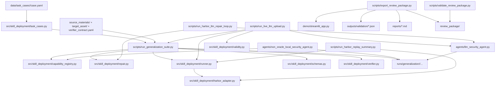

# Module Dependency Map

## Canonical dependency sketch

## Module roles

| Module | Role | Depends on | Used by |
|---|---|---|---|
| `src/skill_deployment/schemas.py` | typed artifact objects | stdlib only | tests, future shared core, partially the conceptual contract |
| `src/skill_deployment/capability_registry.py` | capability vocabulary and detector hints | stdlib only | generalization suite, non-oracle local semantic agent |
| `src/skill_deployment/repair.py` | typed repair operator selection and gate generation | `schemas.py` | generalization suite, tests |
| `src/skill_deployment/harbor_adapter.py` | replay reader for existing Harbor artifacts | `schemas.py` | `runner.py`, replay CLI, tests |
| `src/skill_deployment/runner.py` | backend protocol types plus local backend dispatch | `schemas.py` | generalization suite, local live LLM path, tests |
| `src/skill_deployment/task_cases.py` | shared controlled task-case loader and validator | stdlib only | suite, validator script, tests |
| `src/skill_deployment/verifier.py` | shared controlled verifier logic | `schemas.py` | suite, local live LLM upload path, tests |
| `scripts/run_generalization_suite.py` | main controlled-suite orchestrator | `src/skill_deployment/*`, `revision/repair_policy.json`, optional agents | validation outputs, runs/generalization |
| `agents/non_oracle_local_security_agent.py` | deterministic heuristic target-grounded backend | capability registry, target files, skill manifest | generalization suite with `--backend non_oracle_local_semantic` |
| `agents/local_security_review_agent.py` | simpler deterministic local runner | local constants + target files + skill manifest | separate smoke/audit paths |
| `agents/llm_security_agent.py` | live OpenAI-compatible backend | target files, skill manifest, env vars | local live LLM slice, Harbor wrappers |
| `scripts/run_harbor_llm_repair_loop.py` | Harbor upload A1/A2 slice | LLM agent, repair policy, Harbor substrate | Harbor upload evidence |
| `scripts/run_harbor_llm_repair_loop_config.py` | Harbor config A1/A2 slice | LLM agent, repair policy, Harbor substrate | Harbor config evidence |
| `scripts/export_review_package.py` | artifact packaging | demo run builder, outputs, docs, reports | external review handoff |
| `scripts/validate_review_package.py` | exported-package integrity checks | `review_package/`, regex secret scan | export validation |

## Dependency quality assessment

### Strong edges

- `capability_registry.py` is now genuinely reused across multiple execution paths.
- `repair.py` is the best consolidated mechanism in the repo.
- `task_cases.py` and `verifier.py` now remove two previous script-only bottlenecks.
- `export_review_package.py` and `validate_review_package.py` form a good “trust boundary” for external review artifacts.

### Weak edges

- `runner.py` is now connected to the stable local execution paths, but not Harbor.
- verifier logic is embedded in suite scripts rather than exposed as a reusable module.
- live Harbor execution still duplicates orchestration patterns instead of plugging into one backend interface.
- Harbor replay is now shared, but Harbor execution itself is not.

## Canonical vs legacy paths

### Canonical for current controlled evidence

- `data/task_cases/`
- `src/skill_deployment/repair.py`
- `src/skill_deployment/capability_registry.py`
- `scripts/run_generalization_suite.py`
- `agents/non_oracle_local_security_agent.py`
- `agents/llm_security_agent.py`
- `scripts/export_review_package.py`
- `scripts/validate_review_package.py`

### Legacy or transitional

- `scripts/run_multitask_closed_loop.py`
- `data/api_review_holdout_cases/`
- some older `outputs/mvp_vertical_slice/*` experiments

These are still useful as evidence and historical probes, but they are not the cleanest architecture to extend from.

## Refactor priorities by dependency pain

P0:

1. extract shared verifier module from `scripts/run_generalization_suite.py`
2. unify current task-case loader into `src/skill_deployment/`

P1:

1. make `BackendRunner` real
2. let Harbor and local LLM paths share one execution adapter

P2:

1. de-duplicate old slice scripts
2. reduce report-generation coupling to demo-specific naming

## Addendum: New Shared Edges

The dependency map is now slightly stronger than the original audit snapshot:

- `scripts/run_generalization_suite.py` now depends on `src/skill_deployment/runner.py` for offline/local execution dispatch
- `skill_deployment.TaskCase` now points to the controlled case model rather than the old holdout-only structure
- validity-card generation now has a shared module at `src/skill_deployment/validity.py`
- `scripts/run_live_llm_upload.py` now depends on `src/skill_deployment/runner.py` for local live-LLM execution instead of shelling directly into the agent
- `src/skill_deployment/harbor_adapter.py` plus `scripts/run_harbor_replay_summary.py` now expose the two strongest Harbor repair loops through the shared runner vocabulary
